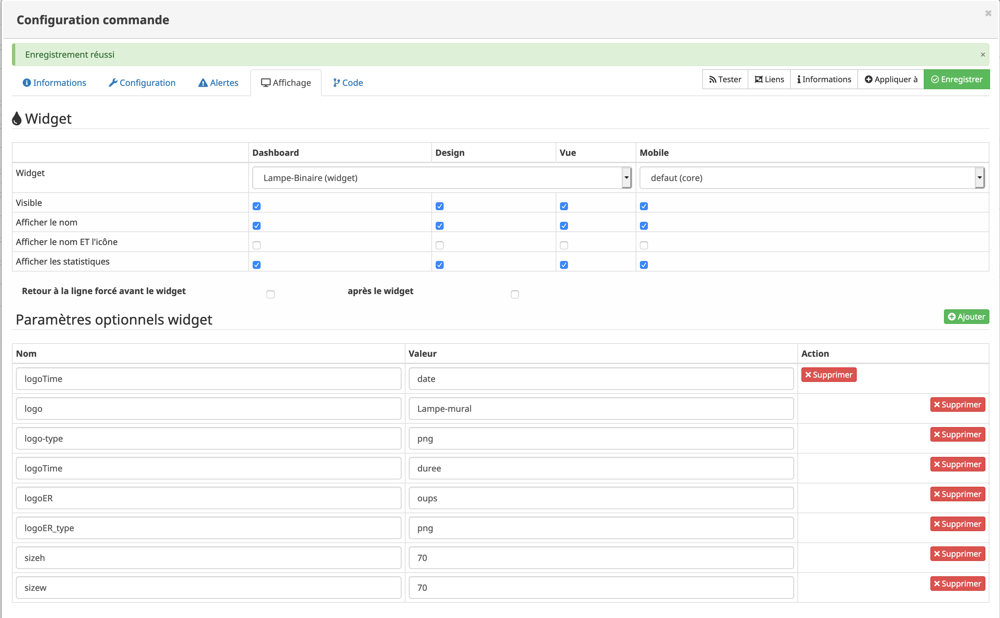

[back](./)
# Aide pour le paramétrage des widgets de type info (binaire, numérique)

<h4 id="Error">Paramétrage de l'équipement</h4>
Ici l'exemple d'un équipement fait avec le plugin info; il faut paramétrer les infos suivantes

<blockquote>
        <ul>
            <li><b>En marron</b> : Nom de la commande</li>
            <li><b>En rouge</b> :  	Sous-Type</li>
             <ul>
                <li>Type : Sélectionner infos</li>
                <li>Sous-Type : électionner le sous type (dans l'exemple "binaire") cela permettra de choisir le widget dédié</li>
            </ul>
            <li><b>Options</b> : Cocher les infos suivantes ou pas</li>
            <ul>
                <li>Afficher : Permet d'afficher l'info sur le dashboard ou sur le mobile</li>
                <li>Historiser : Permet d'historiser l'équipement</li>
            </ul>
        </ul>
</blockquote>

<h4 id="Error">Afficher les statistiques sur les widgets</h4>
Il faut vérifier que la case "Afficher les statistiques sur les widgets" soit coché dans la configuration de jeedoom

<h4 id="Error">Afficher les statistiques sur le widget</h4>
Dans les réglages de chaque commande, cliquer sur la roue

Ensuite cocher <i>Afficher les statistiques</i> soit pour le Dashboard soit pour le mobile soit pour les 2 dans l'onglet <b>Affichage</b>

<dl>
    <dt>Mise à jour JAG - 20190608 
    <a href="https://github.com/JEALG/JEEDOM-Widget_JAG-doc/commits/master">Changelog DOC</a></dt>
</dl>

[back](./)

<h1 id="Aide Paramétrage">Aide pour le paramétrage du widget</h1>

<h5 id="header-5">Paramétrage de l'équipement</h5>
<dl>
    <dd>Cliquez sur la roue crantée à gauche de la commande ON et/ou OFF</dd>
    
</dl>

<h5 id="header-5">Choix du widget et ajout des paramètres</h5>
<dl>
    <dd>Choisir le widget et ajouter les parametres voulus</dd>
    
</dl>