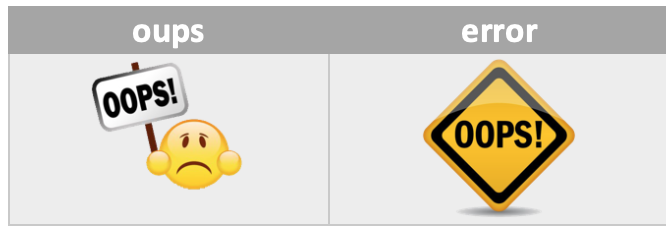

# Paramétrage image défaut Widget 

<h4 id="Error">Choix de l'icône en cas d'erreur</h4>
En cas de défaut d'erreur de valeur sur un widget de type info (binaire - Numérique), le widget affichage un icône d'erreur, il est possible de paramétrer cette image
<blockquote>
        <ul>
            <li><b>logoER</b> : Permet de choisir l'image pour la valeur ETAT en cas de problème <i>(valeur par défaut : oups)</i></li>
            <li><b>logoER_type</b> : Permet de choisir l'extension pour l'image pour la valeur ETAT en cas de problème <i>(valeur par défaut : png)</i></li>
        </ul>
</blockquote>

<dl>
    <dt>Mise à jour JAG - 20190608 
    <a href="https://github.com/JEALG/JEEDOM-Widget_JAG-doc/commits/master">Chancelog DOC</a></dt>
</dl>

[back](./)