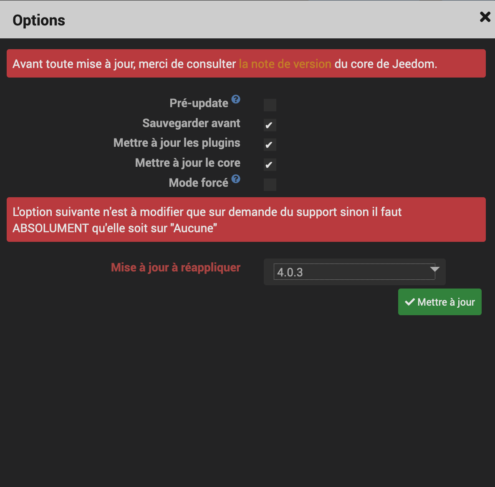

[back](./)
# Info
<blockquote>
Comme vous le savez le plugin widget va disparaitre avec la v4. J'ai trouvé un moyen pour mettre à jour les widgets pour le core V4

</blockquote>

# Mise à jour
<blockquote>
Effectuer toutes les mises à jour du core y compris des plugins/widget. N'oubliez pas de télécharger les widgets Multi-binaire (mobile et dashboard)
</blockquote>
<ul>
Une fois la mise à jour faite, faite une mise à jour du core en sélectionnant dans la case "Mise à jour à réappliquer", la version <b>4.0.3</b>
    
</ul>

# Opération préalable
<blockquote>
    <ul>
        <li>Faire une sauvegade de la jeedom</li>
        <li>Vérifier que vous avez les dernières versions des widgets</li>
        <li>Attention pour les widgets <i><b>Multi info - Binaire</b></i> et <i><b>Multi info - Binaire (mobile)</b></i></li> Il faut les retélécharger depuis le <b>plugin </b> Widget (idem pour la version core V4)
    </ul>
</blockquote>

<dl>
    <a href="https://github.com/JEALG/JEEDOM-Widget_JAG-doc/commits/master">Changelog DOC</a>
</dl>

[back](./)
