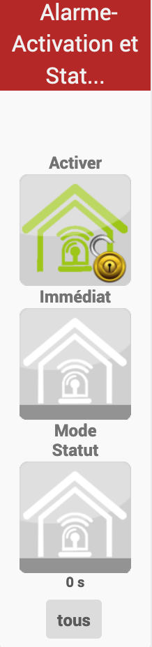
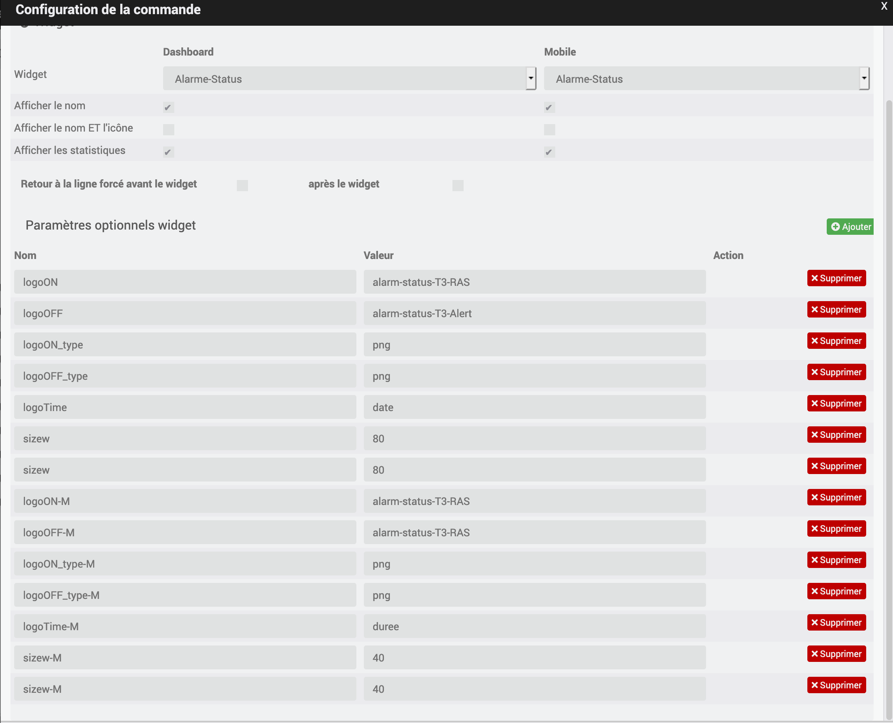

# Widget "Alarme-Status (mobile)" 

Widget pour Jeedom permettant d'afficher une icône pour une fonction de type <b>info binaire</b>

<blockquote>
Le widget inclus d'office 12 types de lampes (6xON et 6xOFF). Il est possible d'ajouter ses propres icônes.
</blockquote>

<h1 id="Type de paramètre">Type de paramètre</h1>

<h4 id="Logo">Choix de l'icône</h4>
Pour choisir le type de visuel à afficher, il faut ajouter les paramètres optionnels suivant :
<blockquote>
        <ul>
            <li><b>logoON</b> : Permet de choisir l'image pour la valeur ON<i>(valeur par défaut : alarm-status-T3-RAS)</i></li>
            <li><b>logoON_type</b> : Permet de choisir l'extension pour l'image pour la valeur ON ou OFF <i>(valeur par défaut : png)</i></li>
            <li><b>logoOFF</b> : Permet de choisir l'image pour la valeur OFF <i>(valeur par défaut : alarm-status-T3-Alert)</i></li>
            <li><b>logoOFF_type</b> : Permet de choisir l'extension pour l'image pour la valeur ON ou OFF <i>(valeur par défaut : png)</i></li>
        </ul>
</blockquote>

<h4 id="Taille">Taille de l'image</h4>
Pour choisir la dimension de l'image il faut ajouter un paramètre optionnel 
<blockquote>
        <ul>
            <li><b>sizeh</b> : Permet de choisir la hauteur de l'image <i>(valeur par défaut : 80)</i></li>
            <li><b>sizew</b> : Permet de choisir la largeur de l'image <i>(valeur par défaut : 80)</i></li>
        </ul>
</blockquote>

<h4 id="TEMPS">Pour afficher les valeurs de temps</h4>
Il est possible d'afficher les informations de temps depuis le dernier allumage/extinction. il suffit d'ajouter un paramètre optionnel <I>Merci à @Salvialf pour le code</I>
<blockquote>
        <ul>
            <li><b>logoTime</b></li>
                <dd><b>logoTime = <i>duree</i></b> : affiche la durée depuis le dernier allumage/extinction. 
                    <b>logoTime = <i>heure</i></b> : affiche l'heure de dernier allumage extinction. 
                    <b>logoTime = <i>date</i></b> : affiche la date et l'heure de dernier allumage/extinction.
                </dd>
        </ul>
</blockquote>
 
<h4 id="Error">Choix de l'icône en cas d'erreur</h4>
En cas de défaut d'erreur, le widget affichage un icône d'erreur, il est possible de paramétrer cette image
<blockquote>
        <ul>
            <li><b>logoER</b> : Permet de choisir l'image pour la valeur ETAT en cas de problème <i>(valeur par défaut : oups)</i></li>
            <li><b>logoER_type</b> : Permet de choisir l'extension pour l'image pour la valeur ETAT en cas de problème <i>(valeur par défaut : png)</i></li>
        </ul>
</blockquote>

<h1 id="Aide Paramétrage">Aide pour le paramétrage du widget</h1>

<h5 id="header-5">Paramétrage de l'équipement</h5>
<dl>
    <dd>Cliquez sur la roue crantée à gauche de la commande ON et/ou OFF</dd>
</dl>

<h5 id="header-5">Choix du widget et ajout des paramètres</h5>
<dl>
    <dd>Choisir le widget et ajouter les parametres voulus</dd>
    
</dl>

<h3 id="Add img">Ajout d'image</h3>

<blockquote>
        Il est possible d'inclure d'autres icônes dans le widget. 
        Le nommage des images n'est pas normalisé pour ce widget
</blockquote>

<dl>
    <dt>Mise à jour JAG - 20190608</dt>
</dl>

[back](./)