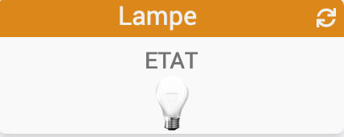
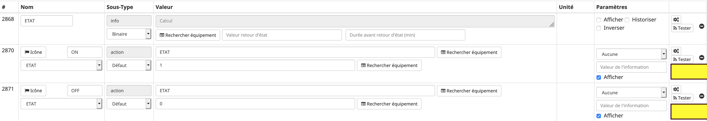
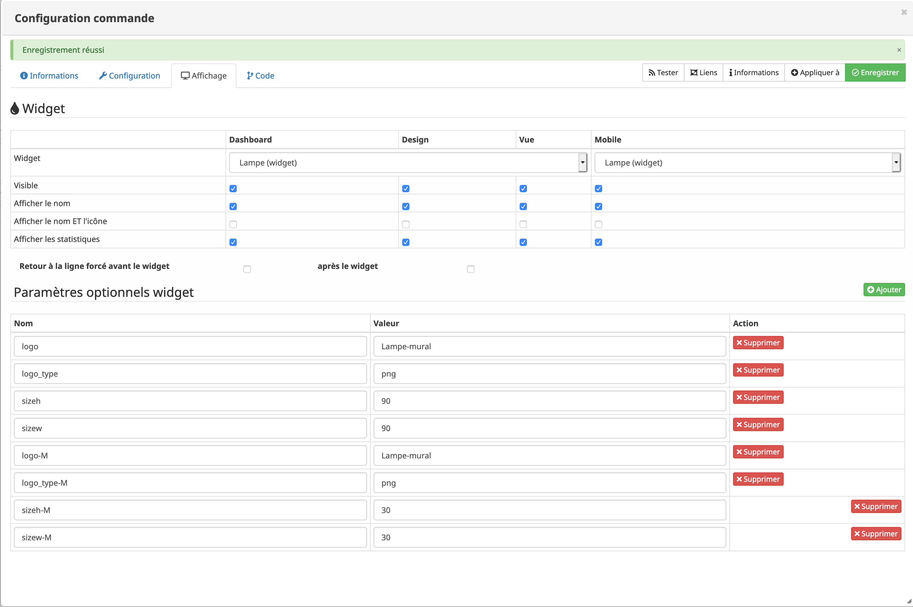

# Widget "Lampe (mobile)" 

Widget pour Jeedom permettant d'afficher une icône pour une fonction de type <b>action ON/OFF</b>

<blockquote>
    Le widget inclus d'office 12 types de lampes (6xON et 6xOFF). Il est possible d'ajouter ses propres icônes.
</blockquote>

<h1 id="Type de paramètre">Type de paramètre</h1>

<h4 id="Logo">Choix de l'icône</h4>
Pour choisir le type de visuel à afficher, il faut ajouter les paramètres optionnels suivant :
<blockquote>
        <ul>
            <li><b>logo-M</b> : Permet de choisir l'image pour la valeur ON ou OFF <i>(valeur par défaut : Lampe)</i></li>
            <li><b>logo_type-M</b> : Permet de choisir l'extension pour l'image pour la valeur ON ou OFF <i>(valeur par défaut : png)</i></li>
        </ul>
</blockquote>

<h4 id="TaIlle">Taille de l'image</h4>
Pour choisir la dimension de l'image il faut ajouter un paramètre optionnel 
<blockquote>
        <ul>
            <li><b>sizeh-M</b> : Permet de choisir la hauteur de l'image <i>(valeur par défaut : 35)</i></li>
            <li><b>sizew-M</b> : Permet de choisir la largeur de l'image <i>(valeur par défaut : 35)</i></li>
        </ul>
</blockquote>

<h1 id="Aide Paramétrage">Aide pour le paramétrage du widget</h1>

<h5 id="header-5">Paramétrage de l'équipement</h5>
<dl>
    <dd>Cliquez sur la roue crantée à gauche de la commande ON et/ou OFF</dd>
    
</dl>

<h5 id="header-5">Choix du widget et ajout des paramètres</h5>
<dl>
    <dd>Choisir le widget et ajouter les parametres voulus (Opération à faire sur la commande ON et OFF)</dd>
    
</dl>
    
<h1 id="Add img">Ajout d'image</h1>

<blockquote>
        Il est possible d'inclure d'autres icônes dans le widget. 
        Le nommage des images est normalisé et doit respecter le format suivant :
        <ul>
            <li><b>Image pour la valeur ON</b> : type-ON</li>
            <li><b>Image pour la valeur OFF</b> : type-OFF</li>
            <li><i>Remplacer <b>type</b> par le nom de l'image</i></li>
        </ul>
</blockquote>

<dl>
    <dt>Mise à jour JAG - 20190608 
    <a href="https://github.com/JEALG/JEEDOM-Lampe--mobile/commits/master">Chancelog WIDGET</a> 
    <a href="https://github.com/JEALG/JEEDOM-Widget_JAG-doc/commits/master">Chancelog DOC</a></dt>
</dl>

[back](./)
