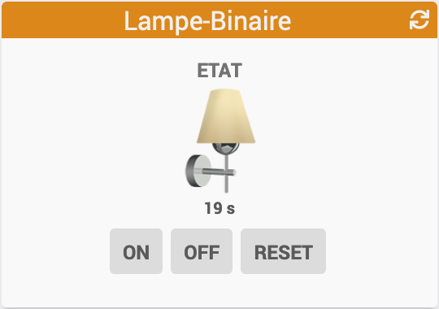
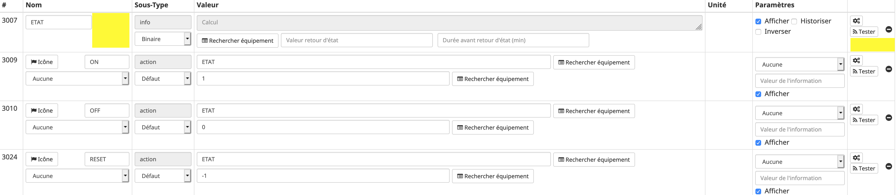
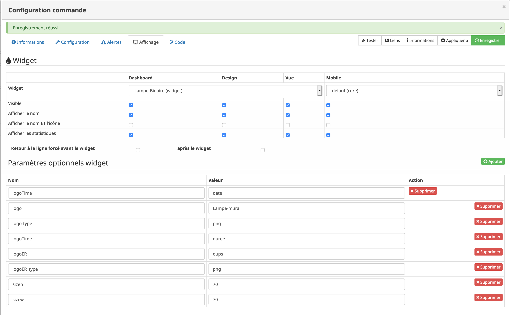

# Widget "Lampe-Binaire" 

Widget pour Jeedom permettant d'afficher une icône pour une fonction de type <b>info binaire</b>

<blockquote>
Le widget inclus d'office 12 types de lampes (6xON et 6xOFF). Il est possible d'ajouter ses propres icônes.
</blockquote>

<h1 id="Type de paramètre">Type de paramètre</h1>

<h4 id="Logo">Choix de l'icône</h4>
Pour choisir le type de visuel à afficher, il faut ajouter les paramètres optionnels suivant :
<blockquote>
        <ul>
            <li><b>logo</b> : Permet de choisir l'image pour la valeur ON ou OFF <i>(valeur par défaut : Lampe)</i></li>
            <li><b>logo_type</b> : Permet de choisir <i>l'extension</i> pour l'icône/image <i>logo</i>(par exemple: 'gif', 'jpg', etc.....)<i>(valeur par défaut : png)</i></li>
        </ul>
</blockquote>

<h4 id="TaIlle">Taille des images ou des icônes</h4>
Il est possible de spécifier la hauteur et la largeur des icônes ou images par l'ajout des paramètres optionnels suivant :
<blockquote>
        <ul>
            <li><b>sizeh</b> : Permet de choisir la hauteur de l'image <i>(valeur par défaut : 80)</i></li>
            <li><b>sizew</b> : Permet de choisir la largeur de l'image <i>(valeur par défaut : 80)</i></li>
        </ul>
</blockquote>

<h4 id="TEMPS">Pour afficher les valeurs de temps</h4>
Il est possible d'afficher les informations de temps depuis le dernier allumage/extinction. il suffit d'ajouter un paramètre optionnel <I>Merci à @Salvialf pour le code</I>
<blockquote>
        <ul>
            <li><b>logoTime</b></li>
                <dd><b>logoTime = <i>duree</i></b> : affiche la durée depuis le dernier allumage/extinction. 
                    <b>logoTime = <i>heure</i></b> : affiche l'heure de dernier allumage extinction. 
                    <b>logoTime = <i>date</i></b> : affiche la date et l'heure de dernier allumage/extinction.
                </dd>
        </ul>
</blockquote>
 
<h4 id="Error">Autres paramétrages possible</h4>
<blockquote>
        <ul>
            <li><a href="JEEDOM-AIDE-Error.html">Paramétrage image de défaut</a></li>
            <li><a href="JEEDOM-AIDE-STATS.html">Afficher les statistiques</a></li>
        </ul>
</blockquote>

<h1 id="Aide Paramétrage">Aide pour le paramétrage du widget</h1>

<h5 id="header-5">Paramétrage de l'équipement</h5>
<dl>
    <dd>Cliquez sur la roue crantée à gauche de la commande ON et/ou OFF</dd>
    
</dl>

<h5 id="header-5">Choix du widget et ajout des paramètres</h5>
<dl>
    <dd>Choisir le widget et ajouter les parametres voulus</dd>
    
</dl>

<h3 id="Add img">Ajout d'image</h3>

<blockquote>
        Il est possible d'inclure d'autres icônes dans le widget. 
        Le nommage des images est normalisé et doit respecter le format suivant :
        <ul>
            <li><b>Image pour la valeur ON</b> : type-ON</li>
            <li><b>Image pour la valeur OFF</b> : type-OFF</li>
            <li><i>Remplacer <b>type</b> par le nom de l'image</i></li>
        </ul> 
</blockquote>

<dl>
    <dt>Mise à jour JAG - 20190608 
    <a href="https://github.com/JEALG/JEEDOM-Lampe-Binaire/commits/master">Chancelog WIDGET</a> 
    <a href="https://github.com/JEALG/JEEDOM-Widget_JAG-doc/commits/master">Chancelog DOC</a></dt>
</dl>

[back](./)