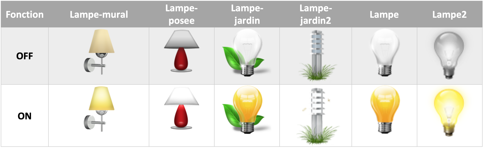
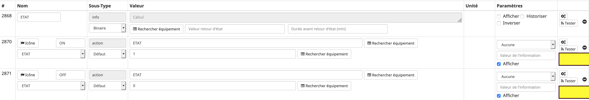
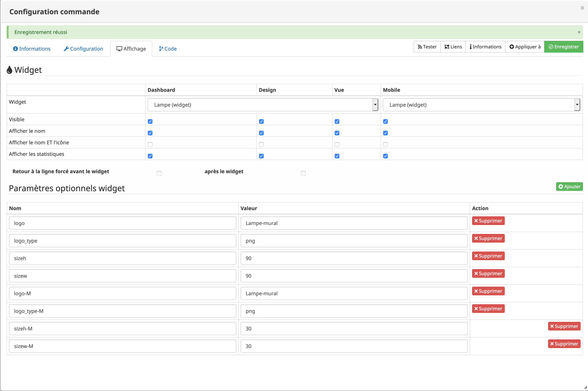

# Widget "Lampe" 

Widget pour Jeedom permettant d'afficher une icône pour une fonction de type <b>action ON/OFF</b>
<blockquote>
Le widget inclus d'office 12 types de lampes (6xON et 6xOFF). Il est possible d'ajouter ses propres icônes.
</blockquote>

<h4 id="Logo">Paramétrage de l'image</h4>
Pour choisir le type de visuel à afficher, il faut ajouter un paramètre optionnel 
<blockquote>
    <ul>
        <li><b>logo</b> : Permet de choisir l'image pour la valeur ON ou OFF <i>(valeur par défaut : Lampe)</i></li>
        <li><b>logo_type</b> : Permet de choisir l'extension pour l'image pour la valeur ON ou OFF <i>(valeur par défaut : png)</i></li>
</ul>
</blockquote>

<h4 id="TaIlle">Taille de l'image</h4>
Pour choisir la dimension de l'image il faut ajouter un paramètre optionnel 
<blockquote>
    <ul>
        <li><b>sizeh</b> : Permet de choisir la hauteur de l'image <i>(valeur par défaut : 80)</i></li>
        <li><b>sizew</b> : Permet de choisir la largeur de l'image <i>(valeur par défaut : 80)</i></li>
</ul>
</blockquote>

<h3 id="Aide Paramétrage">Aide pour le paramétrage du widget</h3>

<h5 id="header-5">Paramétrage de l'équipement</h5>
<dl>
<dd>Cliquez sur la roue crantée à gauche de la commande ON et/ou OFF 
    
</dd>
</dl>

<h5 id="header-5">Choix du widget et ajout des paramètres</h5>
<dl>
<dd>Choisir le widget et ajouter les parametres voulus 
    
</dd>
</dl>
<h3 id="Add img">Ajout d'image</h3>

<blockquote>
Il est possible d'inclure d'autres icônes dans le widget. 
Le nommage des images est normalisé et doit respecter le format suivant :
</blockquote>
 

<blockquote>
    <ul>
        <li><b>Image pour la valeur ON</b> : type-ON <i>(valeur par défaut : 80)</i></li>
        <li><b>Image pour la valeur OFF</b> : type-OFF</li>
        <li> <i>(remplacer <b>type</b> par le nom de votre image)</i></li>
</ul>
</blockquote>

<dl>
<dt>Mise à jour JAG - 20190608</dt>
</dl>

[back](./)