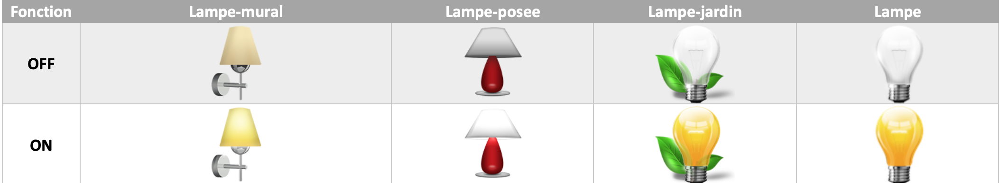

# JEEDOM-Lampe

Widget pour Jeedom permettant d'afficher une icône pour une fonction de type <b>action ON/OFF</b>

Le widget inclus d'office 8 types de lampes (4xON et 4xOFF). Il est possible d'ajouter ses propres icônes.

Pour choisir le type de visuel à afficher, il faut ajouter un paramètre optionnel 
* '**<b>logo</b>**' : Permet de choisir l'image pour la valeur ON ou OFF <i>(valeur par défaut : Lampe) </i>
* '**<b>logo_type</b>**' : Permet de choisir l'extension pour l'image pour la valeur ON ou OFF <i>(valeur par défaut : png) </i>

Pour choisir la dimension de l'image il faut ajouter un paramètre optionnel 
* '**<b>sizeh</b>**' : Permet de choisir l'hauteur de l'image <i>(valeur par défaut : 80) </i>
* '**<b>sizew</b>**' : Permet de choisir la largeur de l'image <i>(valeur par défaut : 80) </i>
  
Vous avez la possibilité d'inclure vos propres icônes dans le widget. Le nommage des images est normalisé et doit respecter le format suivant: 
* **<b>Image pour la valeur ON </b>** : type-ON 
* **<b>Image pour la valeur OFF </b>** : type-OFF 
(remplacer "type" par le nom de votre image) 
Pour ajouter vos icônes, sur la page du Widget, cliquer sur le bouton "Fichiers" tout en haut puis "choisir un fichier" et ajouter vos images une par une. 

<b>Pour le paramétrage dans l'équipement</b> 
Cliquez sur la roue crantée à gauche de la commande ON et/ou OFF 
 
<b>Choisir le widget et ajouter les parametres voulus</b> 
 
