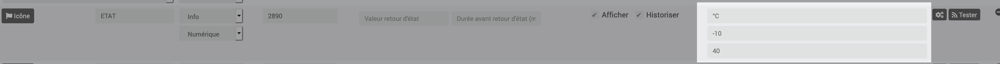

[back](./)
# Widget "Temperature thermometre" 

Widget pour Jeedom permettant d'afficher une icône pour une fonction de type <b>info numérique</b>

<h4 id="A Savoir">A savoir</h4>
<blockquote>
<b>Afin de simplifier la gestion des images, depuis le 10/09/2019, il est necessaire d'avoir le widget "Multi_action-Defaut"</b>
</blockquote>

<h4 id="TaIlle">Affichage de l'historique ou min max sur la gauche</h4>
<blockquote>
        <ul>
            <li><b>min_max</b> : Affiche par défaut le min et max configurer dans l'équipement <i>(valeur par défaut : X)</i></li>
            

            <li><b>min_max</b> : utilise le maxi et le mini de l'historique, <i>la variable doit ête vide</i></li>
        </ul>
</blockquote>
 
<h4 id="Aide">Autres paramétrages possible et Aide</h4>
<blockquote>
        <ul>
            <li><a href="JEEDOM-AIDE-CONFIG-INFO.html">Aide ajout Des paramétres pour un widget Info</a></li>
            <li><a href="JEEDOM-AIDE-Error.html">Paramétrage image de défaut</a></li>
            <li><a href="JEEDOM-AIDE-STATS.html">Afficher les statistiques</a></li>
            <li><a href="JEEDOM-AIDE-SIZE.html">Changer la Taille du texte de l'historique</a></li>
            <li><a href="JEEDOM-AIDE-PARA.html">Ajouter les paramétres sur un widget</a></li>
        </ul>
</blockquote>

<dl>
    <a href="https://github.com/JEALG/JEEDOM-Thermometre/commits/master">Changelog WIDGET</a> 
    <a href="https://github.com/JEALG/JEEDOM-Widget_JAG-doc/commits/master">Changelog DOC</a>
</dl>

[back](./)