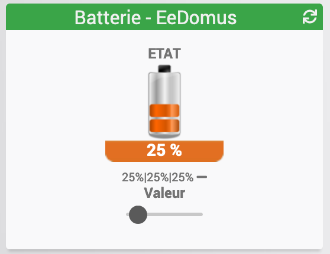

[back](./)
# Widget "Batterie - EeDomus" 

<h4 id="A Savoir">A savoir</h4>
<blockquote>
<b>Afin de simplifier la gestion des images, depuis le 10/09/2019, il est necessaire d'avoir le widget "Multi_action-Defaut"</b>
</blockquote>

Widget pour Jeedom permettant d'afficher une icône pour une fonction de type <b>info binaire</b>

<blockquote>
Le widget inclus d'office 1 type d'icônes.
</blockquote>

<h1 id="Type de paramètre">Type de paramètre</h1>

<h4 id="Logo">Choix de l'icône</h4>
Pour choisir le type de visuel à afficher, il faut ajouter les paramètres optionnels suivant :
<blockquote>
        <ul>
            <li><b>logo</b> : Permet de choisir l'image pour la valeur<i>(valeur par défaut : battery_)</i></li>
            <li><b>logo_type</b> : Permet de choisir <i>l'extension</i> pour l'icône/image <i>logoON</i>(par exemple: 'gif', 'jpg', etc.....)<i>(valeur par défaut : png)</i></li>
            <li><b>logolabel</b> : Permet de choisir l'image pour la valeur OFF <i>(valeur par défaut : bottom_)</i></li>
            <li><b>logolabel_type</b> : Permet de choisir <i>l'extension</i> pour l'icône/image <i>logoOFF</i>(par exemple: 'gif', 'jpg', etc.....)<i>(valeur par défaut : png)</i></li>
        </ul>
</blockquote>

<h4 id="Taille">Taille de l'image</h4>
Il est possible de spécifier la hauteur et la largeur des icônes ou images par l'ajout des paramètres optionnels suivant :
<blockquote>
        <ul>
            <li><b>sizeh</b> : Permet de choisir la hauteur de l'image <i>(valeur par défaut : 65)</i></li>
            <li><b>sizew</b> : Permet de choisir la largeur de l'image <i>(valeur par défaut : 30)</i></li>
        </ul>
</blockquote>

<h4 id="Niveau">Paramétrage des Niveau</h4>
Il est possible de personnaliser les niveaux :
<blockquote>
        <ul>
            <li><b>level_0</b>   : Niveau 0 <i>(valeur par défaut : 0)</i></li>
            <li><b>level_20</b>  : Niveau 20 <i>(valeur par défaut : 20)</i></li>
            <li><b>level_40</b>  : Niveau 40 <i>(valeur par défaut : 40)</i></li>
            <li><b>level_60</b>  : Niveau 60 <i>(valeur par défaut : 60)</i></li>
            <li><b>level_80</b>  : Niveau 80 <i>(valeur par défaut : 80)</i></li>
            <li><b>level_100</b> : Niveau 100 <i>(valeur par défaut : 100)</i></li>
        </ul>
</blockquote>

<h4 id="Aide">Autres paramétrages possible et Aide</h4>
<blockquote>
        <ul>
            <li><a href="./aide/JEEDOM_AIDE_CONFIG_INFOS.html">Aide ajout Des paramétres pour un widget Info</a></li>
            <li><a href="./aide/JEEDOM_AIDE_CONFIG_Error.html">Paramétrage image de défaut</a></li>
            <li><a href="./aide/JEEDOM_AIDE_CONFIG_STATS.html">Afficher les statistiques</a></li>
            <li><a href="./aide/JEEDOM_AIDE_CONFIG_STATS TEMPS.html">Affichage des informations de durée sur les widgets info (binaire, numérique)</a></li>
            <li><a href="./aide/JEEDOM_AIDE_CONFIG_PARA.html">Ajouter les paramétres sur un widget</a></li>
        </ul>
</blockquote>

<h3 id="Add img">Ajout d'image</h3>

<blockquote>
        Il est possible d'inclure d'autres icônes dans le widget. 
        Le nommage des images est normalisé et doit respecter le format suivant :
        <ul>
            <li><b>Image pour la valeur pour le niveau</b> : battery_Niveau</li>
            <li><b>Image pour la valeur pour l'étiquette</b> : bottom_Niveau</li>
            <li><i>Remplacer <b>Niveau</b> par la valeur 0 ou 20 ou 40 ou 60 ou 80 ou 100</i></li>
        </ul>
        <ul>
            <li><a href="./aide/JEEDOM_AIDE_ADD_IMG.html">Ajouter des images dans un widget</a></li>
        </ul> 
</blockquote>

<dl>
    <a href="https://github.com/JEALG/JEEDOM-Batterie-EeDomus/tree/masterv4">Télécharger les sources pour la V4</a> 
    <a href="https://github.com/JEALG/JEEDOM-Batterie-EeDomus/commits/masterv4">Changelog WIDGET pour le Core V4</a> 
    <a href="https://github.com/JEALG/JEEDOM-Batterie-EeDomus/commits/master">Changelog WIDGET pour le Core V3</a> 
    <a href="https://github.com/JEALG/JEEDOM-Widget_JAG-doc/commits/master">Changelog DOC</a>
</dl>

[back](./)