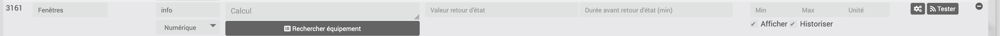
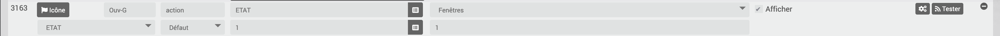
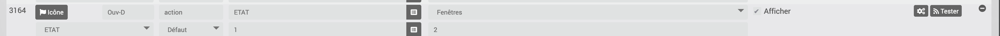
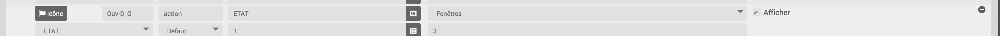
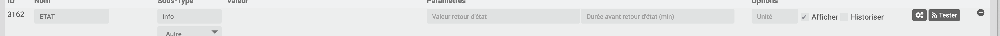
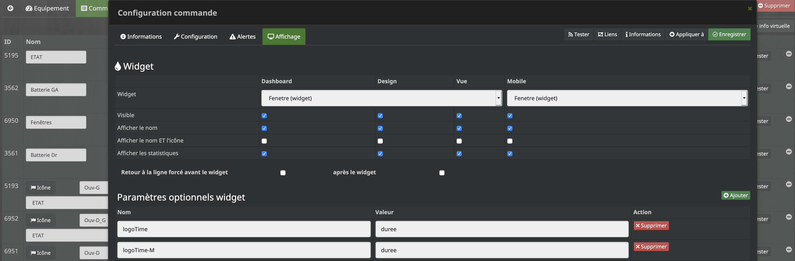
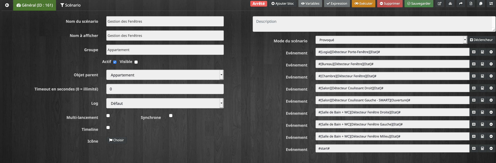
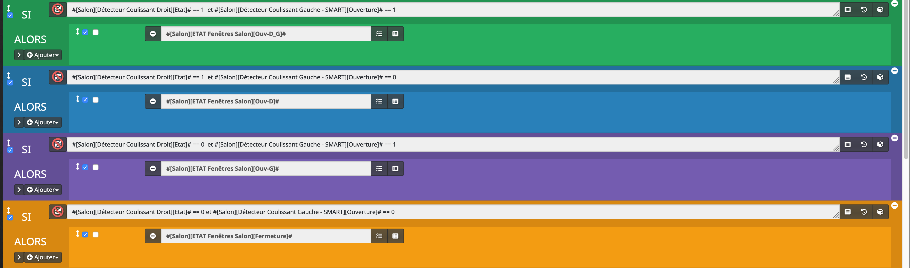

[back](./)
# Widget "Fenêtre (numérique)" 

Widget pour Jeedom permettant d'afficher une icône pour une fonction de type <b>info numérique</b>

<blockquote>
Le widget inclus plusieurs icônes. Il est possible d'ajouter ses propres icônes.
</blockquote>

<blockquote>
<b>Afin de simplifier la gestion des images, depuis le 10/09/2019, il est necessaire d'avoir le widget "Multi_action-Defaut"</b>
</blockquote>

<h1 id="Type de paramètre">Type de paramètre</h1>

<h4 id="Logo">Choix de l'icône</h4>
Pour choisir le type de visuel à afficher, il faut ajouter les paramètres optionnels suivant :
<blockquote>
    <ul>
        <li><b>logo_<b>x</b></b> : Permet de choisir l'image pour la valeur <b>x</b></li>
        <li><b>logo_<b>x</b>_type</b> : Permet de choisir <i>l'extension</i> pour l'icône/image <i>logo_<b>x</b></i> (par exemple: 'gif', 'jpg', etc.....)<i> (valeur par défaut : png)</i></li>
        <li><b>x</b> : Remplacer <b>x</b> par le numéro de la valeur correspondante (valeur possible de 0 à 8)</li>
    </ul>
</blockquote>
<blockquote>
    Les valeurs pour la variable <b>logo_x</b>par défaut sont :
    <ul>
        <li><b>logo_<b>0</b></b> : <i>valeur par défaut : ou_baie2_wh_db_off</i></li>
        <li><b>logo_<b>1</b></b> : <i>valeur par défaut : ou_baie2_wh_lf_on</i></li>
        <li><b>logo_<b>2</b></b> : <i>valeur par défaut : ou_baie2_wh_rg_on</i></li>
        <li><b>logo_<b>3</b></b> : <i>valeur par défaut : ou_baie2_wh_db_on</i></li>
        <li><b>logo_<b>4</b></b> : <i>valeur par défaut : ou_baie2_wh_db_on</i></li>
        <li><b>logo_<b>5</b></b> : <i>valeur par défaut : ou_baie2_wh_db_on</i></li>
        <li><b>logo_<b>6</b></b> : <i>valeur par défaut : ou_baie2_wh_db_on</i></li>
        <li><b>logo_<b>7</b></b> : <i>valeur par défaut : ou_baie2_wh_db_on</i></li>
        <li><b>logo_<b>8</b></b> : <i>valeur par défaut : ou_baie2_wh_db_on</i></li>
    </ul>
</blockquote>
            
<h4 id="Logo">Choix de la valeur</h4>
Pour choisir le type de visuel à afficher, il faut ajouter les paramètres optionnels suivant :
<blockquote>
    <ul>
        <li><b>valeur_<b>x</b></b> : Permet de choisir l'image pour la valeur <b>x</b></li>
        <li><b>x</b> : Remplacer <b>x</b> par le numéro de la valeur correspondante (valeur possible de 0 à 5)</li>
    </ul>
</blockquote>
<blockquote>
     Les valeurs pour la variable <b>valeur_x</b>par défaut sont :
    <ul>
        <li><b>valeur_<b>0</b></b> : <i>valeur par défaut : 0</i></li>
        <li><b>valeur_<b>1</b></b> : <i>valeur par défaut : 1</i></li>
        <li><b>valeur_<b>2</b></b> : <i>valeur par défaut : 2</i></li>
        <li><b>valeur_<b>3</b></b> : <i>valeur par défaut : 3</i></li>
        <li><b>valeur_<b>4</b></b> : <i>valeur par défaut : 4</i></li>
        <li><b>valeur_<b>5</b></b> : <i>valeur par défaut : 5</i></li>
        <li><b>valeur_<b>6</b></b> : <i>valeur par défaut : 6</i></li>
        <li><b>valeur_<b>7</b></b> : <i>valeur par défaut : 7</i></li>
        <li><b>valeur_<b>8</b></b> : <i>valeur par défaut : 8</i></li>
    </ul>
</blockquote>      

<h4 id="Taille">Taille des images ou des icônes</h4>
Il est possible de spécifier la hauteur et la largeur des icônes ou images par l'ajout des paramètres optionnels suivant :
<blockquote>
        <ul>
            <li><b>Pourcentage</b> : Permet de choisir la taille en "px" ou "%" <i>(valeur par défaut : NO donc "px")</i></li>
            <ul>
                <li><i>Pourcentage = NO</i> la taille sera en "px"</li>
                <li><i>Pourcentage = YES</i> la taille sera en "%"</li>
            </ul>
            <li><b>sizeh</b> : Permet de choisir la hauteur de l'image <i>(valeur par défaut : 80)</i></li>
            <li><b>sizew</b> : Permet de choisir la largeur de l'image <i>(valeur par défaut : 80)</i></li>
        </ul>
</blockquote>

<h4 id="Exemples">Exemples de paramétrage</h4>
Voici un exemple de configuration
<blockquote>
        <li><b>Ma config</b> : 1 baie avec 2 capteurs</li>
</blockquote> 

<blockquote>
Tout d'abord j'ai créé un virtuel avec comme configs :
    <ul>
        <li>Avec une <i>info virtuelle</i> avec le nom <i>Fenêtre</i> : Cette info aura juste la fonction d'affichage</li>
        
        <li>Avec une <i>commande virtuelle</i> avec le nom <i>Ouv-G</i> : Correspond à l'état de la fenêtre de gauche, j'affecte les valeurs suivantes :
            <ul>
                <li><b>ETAT</b> aura la valeur 1 </li>
                <li><b>Fenêtres</b> aura la valeur 1 </li>
            </ul>
        </li>
        
        <li>Avec une <i>commande virtuelle</i> avec le nom <i>Ouv-D</i> : Correspond à l'état de la fenêtre de droite</li>
        
        <li>Avec une <i>commande virtuelle</i> avec le nom <i>Ouv-D_G</i> : Correspond à l'état des 2 fenêtres</li>
        
        <li>Avec une <i>info virtuelle</i> avec le nom <i>ETAT</i> : Cette info sera créer automatiquement lors de la création des commandes, elle servira pour l'ensemble de mes scénarios</li>
        
    </ul>
</blockquote>
<blockquote>
et j'ai configuré l'etat "Fenêtres"
</blockquote>

<blockquote>
Ensuite j'ai créer un scénario avec le paramétrage suivant
</blockquote>

 
<h4 id="Aide">Autres paramétrages possible et Aide</h4>
<blockquote>
        <ul>
            <li><a href="./aide/JEEDOM_AIDE_CONFIG_INFOS.html">Aide ajout Des paramétres pour un widget Info</a></li>
            <li><a href="./aide/JEEDOM_AIDE_Error.html">Paramétrage image de défaut</a></li>
            <li><a href="./aide/JEEDOM_AIDE_STATS_TEMPS.html">Affichage des informations de durée sur les widgets info (binaire, numérique)</a></li>
            <li><a href="./aide/JEEDOM_AIDE_PARA.html">Ajouter les paramétres sur un widget</a></li>
        </ul>
</blockquote>

<h3 id="Add img">Ajout d'image</h3>

<blockquote>
        Il est possible d'inclure d'autres icônes dans le widget. 
        Le nommage des images n'est pas normalisé sur ce widget
        <ul>
            <li><a href="./aide/JEEDOM_AIDE_ADD_IMG.html">Ajouter des images dans un widget</a></li>
        </ul>
</blockquote>

<dl>
    <a href="https://github.com/JEALG/JEEDOM-Fenetre/commits/master">Changelog WIDGET</a> 
    <a href="https://github.com/JEALG/JEEDOM-Widget_JAG-doc/commits/master">Changelog DOC</a>
</dl>

[back](./)