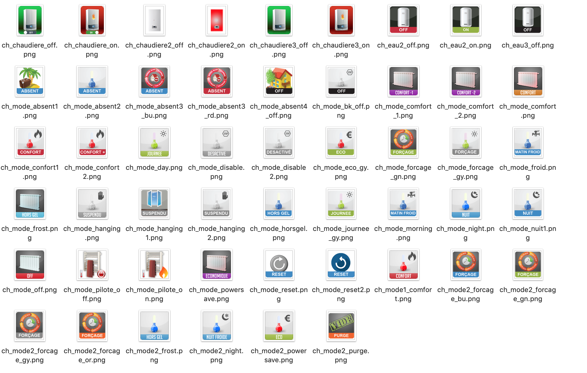
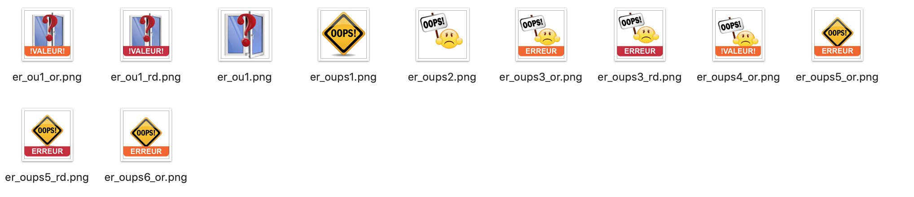
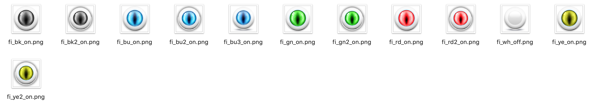
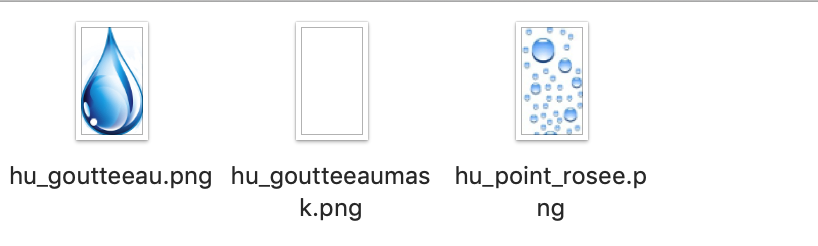
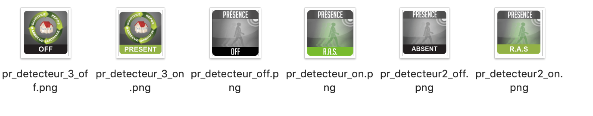
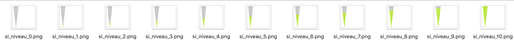
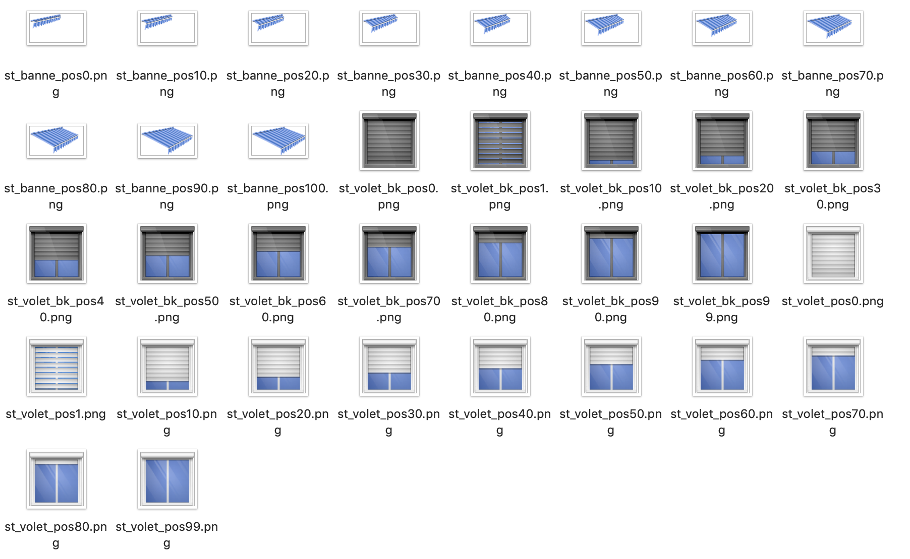
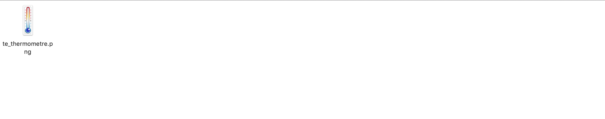
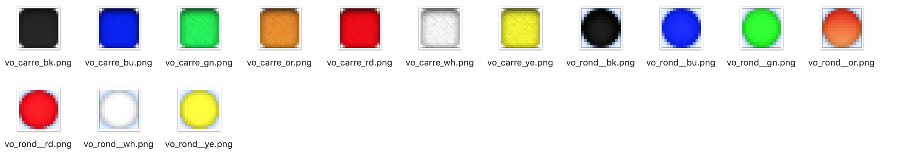

[back](./)
# Liste des images dans les dossiers
Liste des images par dossiers
<blockquote>
    <ul>
        <li>alarme</li>
        

        <li>baro</li>
        

        <li>batterie</li>
        

        <li>chauffage</li>
        

        <li>courriers</li>
        

        <li>divers</li>
        

        <li>eau</li>
        

        <li>error</li>
        

        <li>fenetre</li>
        

        <li>fibarooeil</li>
        

        <li>humidite</li>
        

        <li>lampe</li>
        

        <li>poubelles</li>
        

        <li>presence</li>
        

        <li>prise</li>
        

        <li>season</li>
        

        <li>signal</li>
        

        <li>store</li>
        

        <li>temperature</li>
        

        <li>toggle</li>
        

        <li>vent</li>
        

        <li>voyant</li>
        

    </ul>
</blockquote>

<dl>
    <a href="https://github.com/JEALG/JEEDOM-Widget_JAG-doc/commits/master">Changelog DOC</a>
</dl>

* Les informations système
* Le nombre d'appels en absences
    * Le nombre d'appels passés

[back](./)
