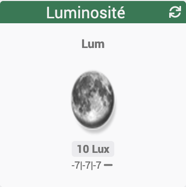

[back](./)
# Widget "Luminosité-IMG" 

Widget pour Jeedom permettant d'afficher une icône pour une fonction de type <b>info numérique</b>

<h4 id="Taille">Info du 26/08/2019 s</h4>
Ce widget est supprimé, il est remplacé par <a href="JEEDOM-Lum_IMG_mini.html">Luminosité-IMG-Min</a>
<blockquote>
        <ul>
            Le paramétrage est identique
        </ul>
</blockquote>

<dl>
    <a href="https://github.com/JEALG/JEEDOM-Luminosite-IMG/commits/master">Changelog WIDGET</a> 
    <a href="https://github.com/JEALG/JEEDOM-Widget_JAG-doc/commits/master">Changelog DOC</a>
</dl>

[back](./)