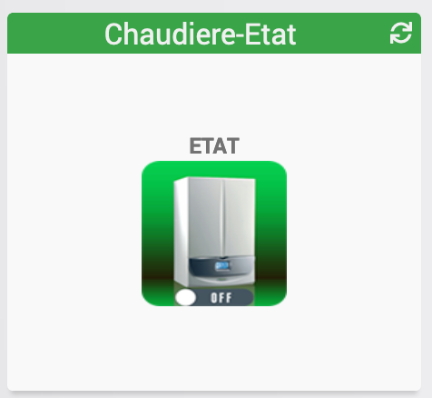

[back](./)
# Widget "Multi-info-Binaire" 

Widget pour Jeedom permettant d'afficher une icône pour une fonction de type <b>info binaire</b>
<blockquote>
    Ce widget regroupe l'ensemble des différentes images de mes widgets
</blockquote>

<blockquote>
    Le widget inclus plusieurs icônes dans des sous dossiers
</blockquote>

<h4 id="A Savoir">A savoir</h4>
<blockquote>
<b>Afin de simplifier la gestion des images, depuis le 10/09/2019, il est necessaire d'avoir le widget "Multi_action-Defaut"</b>
</blockquote>

<h1 id="Type de paramètre">Type de paramètre</h1>

<h4 id="Logo">Choix de l'icône</h4>
Pour choisir le type de visuel à afficher, il faut ajouter les paramètres optionnels suivant :
Dans le cas de l'utilisation avec le nom de l'image normalisé
<blockquote>
        <ul>
            <li><b>logo</b> : Permet de choisir l'image pour la valeur ON ou OFF <i>(pas de valeur par défaut)</i></li>
            <li><b>logo_type</b> : Permet de choisir <i>l'extension</i> pour l'icône/image <i>logo</i> (par exemple: 'gif', 'jpg', etc.....)<i>(valeur par défaut : png)</i></li>
            <li>Le nommage des images normalisées doit respecter le format suivant :</li>
            <ul>
                <li><b>Image pour la valeur ON</b> : type_on</li>
                <li><b>Image pour la valeur OFF</b> : type_off</li>
                <li><i>Remplacer <b>type</b> par le nom de l'image</i></li>
                <li><i>à renseigner dans la variable logo <b>type</b></i></li>
            </ul>
            <li><b>l'utilisation de cette méthode désactive les variables <i>logoON</i> et <i>logoOFF</i></b> </li>
        </ul>
</blockquote>
Dans le cas de l'utilisation avec le nom de l'image non normalisé
<blockquote>
        <ul>
            <li><b>logoON</b> : Permet de choisir l'image pour la valeur ON <i>(valeur par défaut : fi_wh_off")</i></li>
            <li><b>logoON_type</b> : Permet de choisir <i>l'extension</i> pour l'icône/image <i>logoON</i> (par exemple: 'gif', 'jpg', etc.....)<i> (valeur par défaut : png)</i></li>
            <li><b>logoOFF</b> : Permet de choisir l'image pour la valeur OFF <i>(valeur par défaut : fi_bu_on)</i></li>
            <li><b>logoOFF_type</b> : Permet de choisir <i>l'extension</i> pour l'icône/image <i>logoOFF</i> (par exemple: 'gif', 'jpg', etc.....)<i> (valeur par défaut : png)</i></li>
        </ul>
</blockquote>

<h4 id="Dossier">Sous dossier</h4>
Il possible d'ajouter de mettre les images dans des sous dossiers, (la variable est valable pour l'ensemble des valeurs)
<blockquote>
        <ul>
            <li><b>dossier</b> : Nom du dossier (Par défaut : fibarooeil)</li>
            <li><a href="./JEEDOM_Liste_images_dossiers.html">Listes des images par dossiers</a></li>
        </ul>
</blockquote>

<h4 id="Taille">Taille des images ou des icônes</h4>
Il est possible de spécifier la hauteur et la largeur des icônes ou images par l'ajout des paramètres optionnels suivant :
<blockquote>
        <ul>
            <li><b>Pourcentage</b> : Permet de choisir la taille en "px" ou "%" <i>(valeur par défaut : NO donc "px")</i></li>
            <ul>
                <li><i>Pourcentage = NO</i> la taille sera en "px"</li>
                <li><i>Pourcentage = YES</i> la taille sera en "%"</li>
            </ul>
            <li><b>sizeh</b> : Permet de choisir la hauteur de l'image <i>(valeur par défaut : 80)</i></li>
            <li><b>sizew</b> : Permet de choisir la largeur de l'image <i>(valeur par défaut : 80)</i></li>
        </ul>
</blockquote>

<h4 id="Aider">Autres paramétrages possible et Aide</h4>
<blockquote>
        <ul>
            <li><a href="./aide/JEEDOM_AIDE_CONFIG_INFOS.html">Aide pour le paramétrage des widgets de type infos</a></li>
            <li><a href="./aide/JEEDOM_AIDE_STATS.html">Afficher les statistiques</a></li>
            <li><a href="./aide/JEEDOM_AIDE_STATS_TEMPS.html">Affichage des informations de durée sur les widgets info (binaire, numérique)</a></li>
            <li><a href="./aide/JEEDOM_AIDE_PARA.html">Ajouter les paramétres sur un widget</a></li>
        </ul>
</blockquote>

<dl>
    <a href="https://github.com/JEALG/JEEDOM-Multi_info-Binaire/tree/masterv4">Télécharger les sources pour la V4</a> 
    <a href="https://github.com/JEALG/JEEDOM-Multi_info-Binaire/commits/masterv4">Changelog WIDGET pour le Core V4</a> 
    <a href="https://github.com/JEALG/JEEDOM-Multi_info-Binaire/commits/master">Changelog WIDGET pour le Core V3</a> 
    <a href="https://github.com/JEALG/JEEDOM-Widget_JAG-doc/commits/master">Changelog DOC</a>
</dl>

[back](./)