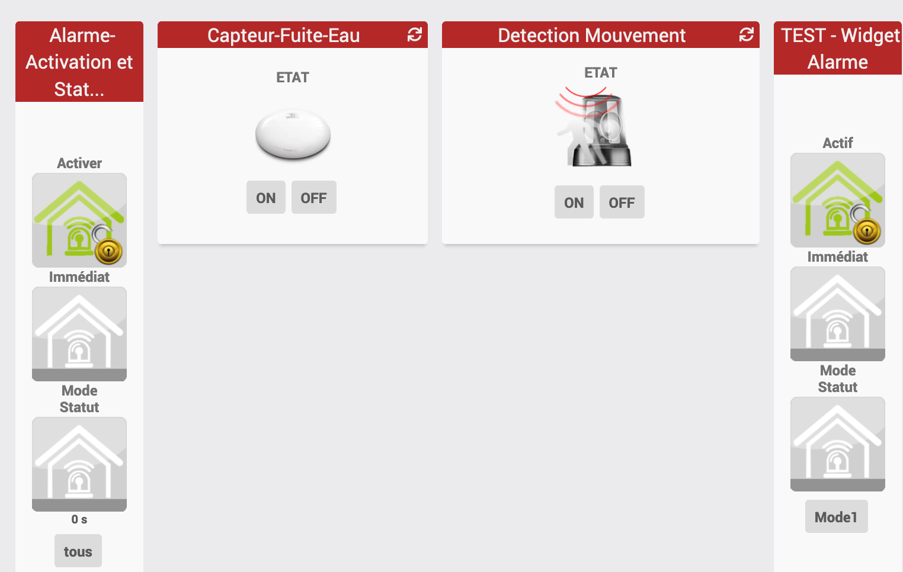

# JEEDOM-Widget DOC JAG

<h1 id="Alarme diverse">Alarme diverse</h1>

<ul>
    <li><a href="./JEEDOM-Alarme-Activation-README.html">Widget Dashboard : <b>Alarme Activation</b></a></li>
    <li><a href="./JEEDOM-Alarme-Activation--MOBILE-README.html">Widget mobile : <b>Alarme-Activation (mobile)</b></a></li>
    <li><a href="./JEEDOM-Alarme-Status-README.html">Widget Dashboard : <b>Alarme-Status</b></a></li>
    <li><a href="./JEEDOM-Alarme-Status--MOBILE-README.html">Widget mobile : <b>Alarme-Status (mobile)</b></a></li>
    <li><a href="./JEEDOM-Capteur-Fuite-Eau -README.html">Widget Dashboard : <b>Capteur-Fuite-Eau</b></a></li>
    <li><a href="./JEEDOM-Lampe-Binaire-README.html">Widget Dashboard : <b>Lampe-Binaire</b></a></li>
    <li><a href="./JEEDOM-Lampe-Binaire-README.html">Widget Dashboard : <b>Lampe-Binaire</b></a></li>
    <li><a href="./JEEDOM-Lampe-Binaire-README.html">Widget Dashboard : <b>Lampe-Binaire</b></a></li>
</ul>

<h1 id="Lumière">Lumière</h1>
<ul>
  <li><a href="./JEEDOM-Lampe-README.html">Widget Dashboard : <b>Lampe</b></a></li>
  <li><a href="./JEEDOM-Lampe--MOBILE-README.html">Widget mobile : <b>Lampe (mobile)</b></a></li>
  <li><a href="./JEEDOM-Lampe-Binaire-README.html">Widget Dashboard : <b>Lampe-Binaire</b></a></li>
</ul>

<dl>
    <dt>Mise à jour JAG - 20190608 
    <a href="https://github.com/JEALG/JEEDOM-Widget_JAG-doc/commits/master">Chancelog DOC</a></dt>
</dl>