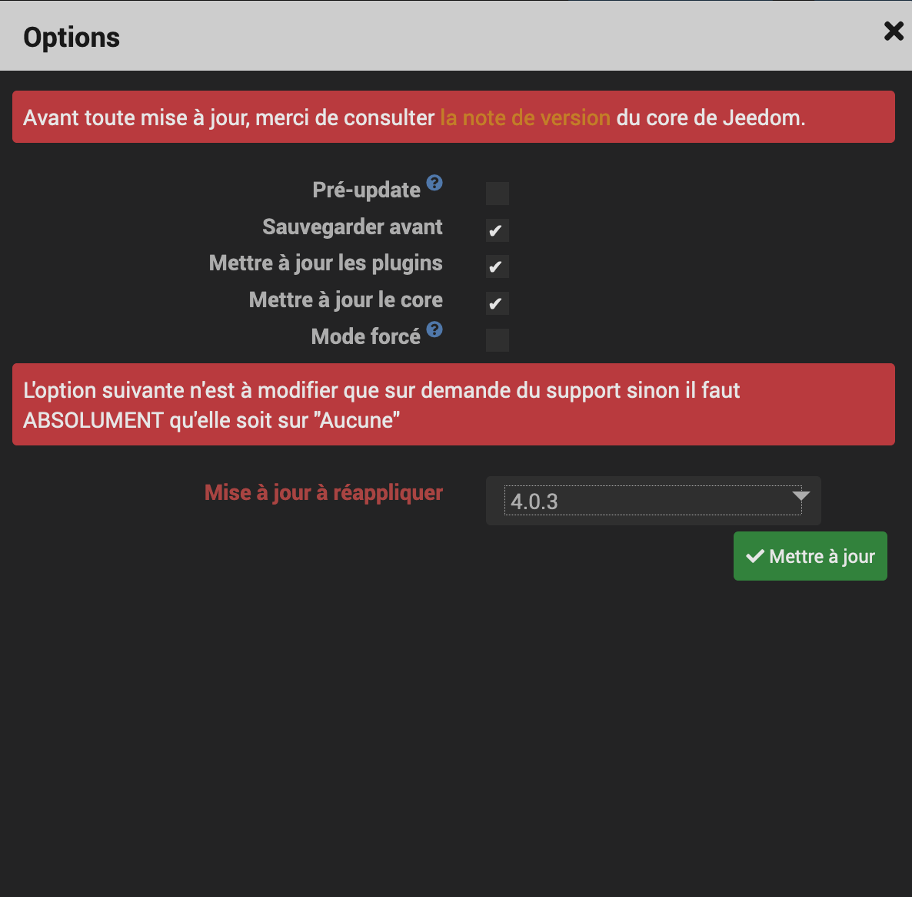

[back](../)
# Info
<blockquote>
Comme vous le savez le plugin widget va disparaitre avec la v4. Si vous voulez continuer à utiliser mes widgets et avoir les mises à jour. Voici une méthode vous permetant d'installation et de mise à jour
</blockquote>

# A Savoir
<blockquote>
Pour l'ensemble de mes widgets, il est nécessaire d'avoir le widget <b><i>JEEDOM-Multi_action-Defaut</i></b>
</blockquote>

# Récupérer les sources
Les sources sont disponible sur mon github 
<a href="https://github.com/JEALG">Mon Github</a>
Choisir le widget voulu
voici un exemple pour récupèrer les sources
<a href="https://github.com/JEALG/JEEDOM-Multi_action-Defaut">JEEDOM-Multi_action-Defaut</a>

Sélectionner la branche voulu :
* Beta : Version en test 
* Master : Version Stable pour le Core <b>V3</b>
* MasterV4 : Version Stable pour le core <b>V4</b>
Cliquer sur <i>Clone or download</i> ensuite cliquer sur <i>Download ZIP</i>

# Mise à jour
<blockquote>
Effectuer toutes les mises à jour du core y compris des plugins/widget. N'oubliez pas de télécharger les widgets Multi-binaire (mobile et dashboard)
</blockquote>
<ul>
Une fois la mise à jour faite, faite une mise à jour du core en sélectionnant dans la case "Mise à jour à réappliquer", la version <b>4.0.3</b>
Cela va permettre par un script de déplacer les widgets dans le nouveau dossier
    
</ul>

<dl>
    <a href="https://github.com/JEALG/JEEDOM-Widget_JAG-doc/commits/master">Changelog DOC</a>
</dl>

[back](../)
