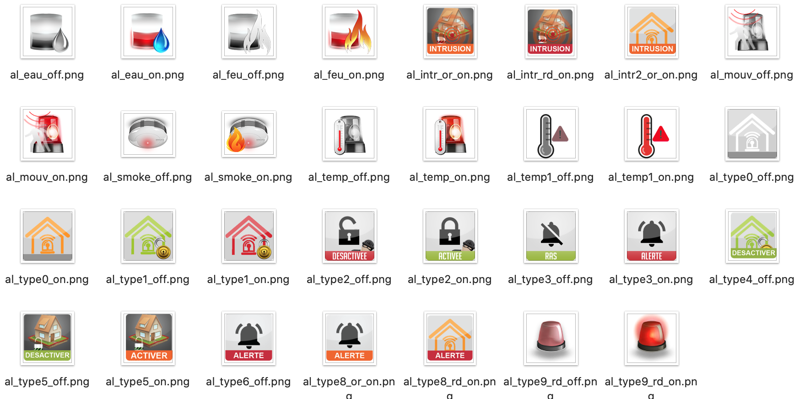

[back](../)
# Widget "Alarme-Status (mobile)" 

Widget pour Jeedom permettant d'afficher une icône pour une fonction de type <b>info binaire</b>

<blockquote>
Le widget inclus plusieurs icônes. Il est possible d'ajouter ses propres icônes.
</blockquote>

<h4 id="A Savoir">A savoir</h4>
<blockquote>
<b>Afin de simplifier la gestion des images, depuis le 10/09/2019, il est necessaire d'avoir la version dashboard du widget</b>
</blockquote>

<h1 id="Type de paramètre">Type de paramètre</h1>

<h4 id="Logo">Choix de l'icône</h4>
Pour choisir le type de visuel à afficher, il faut ajouter les paramètres optionnels suivant :
<blockquote>
        <ul>
            <li><b>logoON-M</b> : Permet de choisir l'image pour la valeur ON <i>(valeur par défaut : al_type0_off)</i></li>
            <li><b>logoON_type-M</b> : Permet de choisir <i>l'extension</i> pour l'icône/image <i>logoON-M</i> (par exemple: 'gif', 'jpg', etc.....)<i>(valeur par défaut : png)</i></li>
            <li><b>logoOFF-M</b> : Permet de choisir l'image pour la valeur OFF <i>(valeur par défaut : al_type0_on)</i></li>
            <li><b>logoOFF_type-M</b> : Permet de choisir <i>l'extension</i> pour l'icône/image <i>logoOFF-M</i> (par exemple: 'gif', 'jpg', etc.....)<i>(valeur par défaut : png)</i></li>
        </ul>
</blockquote>

<h4 id="Taille">Taille des images ou des icônes</h4>
Il est possible de spécifier la hauteur et la largeur des icônes ou images par l'ajout des paramètres optionnels suivant :
<blockquote>
        <ul>
            <li><b>sizeh-M</b> : Permet de choisir la hauteur de l'image <i>(valeur par défaut : 40)</i></li>
            <li><b>sizew-M</b> : Permet de choisir la largeur de l'image <i>(valeur par défaut : 40)</i></li>
        </ul>
</blockquote>

<dl>
    <a href="https://github.com/JEALG/JEEDOM-Alarme-Status--MOBILE/commits/master">Changelog WIDGET</a> 
    <a href="https://github.com/JEALG/JEEDOM-Widget_JAG-doc/commits/master">Changelog DOC</a>
</dl>

[back](./)