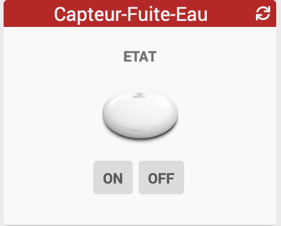
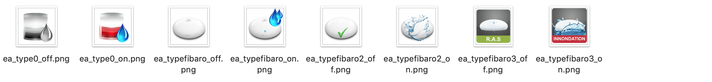

[back](../JEEDOM_Archive_info_binaire.html)
# Widget "Capteur-Fuite-Eau" 

Widget pour Jeedom permettant d'afficher une icône pour une fonction de type <b>info binaire</b>

<blockquote>
Le widget inclus plusieurs icônes. Il est possible d'ajouter ses propres icônes.
</blockquote>

<h1 id="Type de paramètre">Type de paramètre</h1>

<h4 id="Logo">Choix de l'icône</h4>
Pour choisir le type de visuel à afficher, il faut ajouter les paramètres optionnels suivant :
<blockquote>
        <ul>
            <li><b>logoON</b> : Permet de choisir l'image pour la valeur ON ou OFF <i>(valeur par défaut : ea_typefibaro_off)</i></li>
            <li><b>logoON_type</b> : Permet de choisir <i>l'extension</i> pour l'icône/image <i>logoON</i> (par exemple: 'gif', 'jpg', etc.....)<i>(valeur par défaut : png)</i></li>
            <li><b>logoON</b> : Permet de choisir l'image pour la valeur ON ou OFF <i>(valeur par défaut : ea_typefibaro_on)</i></li>
            <li><b>logoON_type</b> : Permet de choisir <i>l'extension</i> pour l'icône/image <i>logoOFF-M</i> (par exemple: 'gif', 'jpg', etc.....)<i>(valeur par défaut : png)</i></li>
        </ul>
</blockquote>

<h4 id="Taille">Taille des images ou des icônes</h4>
Il est possible de spécifier la hauteur et la largeur des icônes ou images par l'ajout des paramètres optionnels suivant :
<blockquote>
        <ul>
            <li><b>sizeh</b> : Permet de choisir la hauteur de l'image <i>(valeur par défaut : 72)</i></li>
            <li><b>sizew</b> : Permet de choisir la largeur de l'image <i>(valeur par défaut : 72)</i></li>
        </ul>
</blockquote>

<dl>
    <a href="https://github.com/JEALG/JEEDOM-Capteur-Fuite-Eau/commits/master">Changelog WIDGET</a> 
    <a href="https://github.com/JEALG/JEEDOM-Widget_JAG-doc/commits/master">Changelog DOC</a>
</dl>

[back](../JEEDOM_Archive_info_binaire.html)