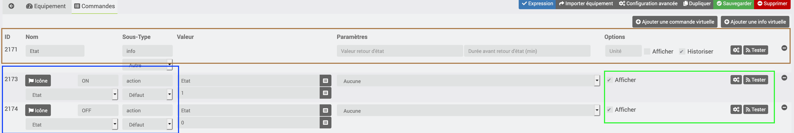
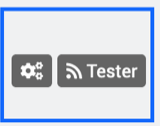
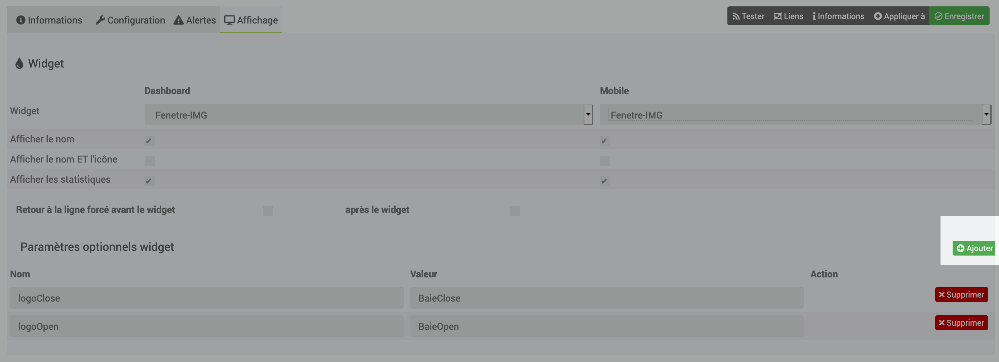
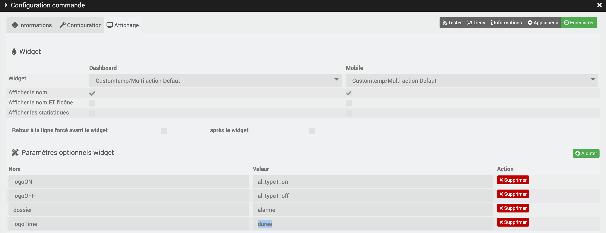

[back](./)
# Aide pour le paramétrage des widgets de type action

Ici l'exemple d'un équipement fait avec le plugin Virtuel, il faut paramétrer les infos suivantes :

# Paramétrage de l'équipement

* <b>En marron</b> : Action du widget
    * Options : il est possible de cocher ou pas <i>Afficher</i> (je conseille de décocher)

* <b>En Bleu</b> : les boutons
	* Type : Sélectionner action
	* Sous-Type : Défaut
    * Options : Cocher la case Afficher
	* Roue cranté : permet de choisir le type de widget et les options
    * Sous les commandes : Il faut absolument sélectionner le nom de l'état pour que le widget fonctionne

# Choix du widget
Cliquer sur la roue crantée (voir image ci-dessous)

Cliquer sur affichage, sélectionner ensuite le widget voulu

## Exemple de paramétrage
Voici l'exemple voulu

## Ajout des paramètres
Cliquer sur le bouton <i>Ajouter</i> pour ajouter les différents paramètres du widget, ensuite se référer sur chacun des widgets pour avoir les variables

### Pour la commande <b>Etat</b>
Vu que cette commande n'est pas affichée, le paramétrage sera laissé en <b>Défaut</b>

### Pour la commande <b>ON</b>
Les paramètres suivants seront mis :

* <b>Widget</b> : Choix du widget
    * Dashboard : Customtemp/Multi-action-Defaut
    * mobile : Customtemp/Multi-action-Defaut

* <b>Paramètres optionnels widget </b> : les variables ci-dessous seront ajouté en cliquant sur le bouton <i>Ajouter</i>
	* logoON : al_type1_on
    * logoOFF : al_type1_off
    * dossier : alarme
    * logoTime : duree

### Pour la commande <b>OFF</b>
Les paramètres suivants seront mis :

* <b>Widget</b> : Choix du widget
    * Dashboard : Customtemp/Multi-action-Defaut
    * mobile : Customtemp/Multi-action-Defaut

* <b>Paramètres optionnels widget </b> : les variables ci-dessous seront ajouté en cliquant sur le bouton <i>Ajouter</i>
	* logoON : al_type1_on
    * logoOFF : al_type1_off
    * dossier : alarme
    * logoTime : duree

# Changelog
<a href="https://github.com/JEALG/JEEDOM-Widget_JAG-doc/commits/master">Changelog DOC</a>

[back](./)