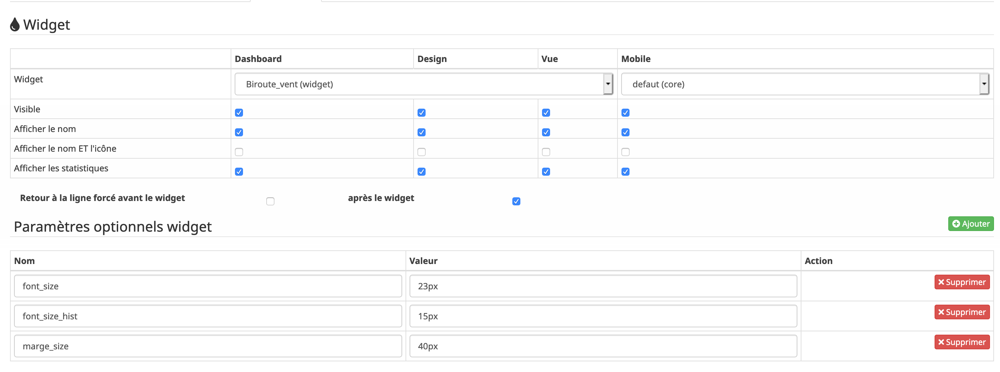
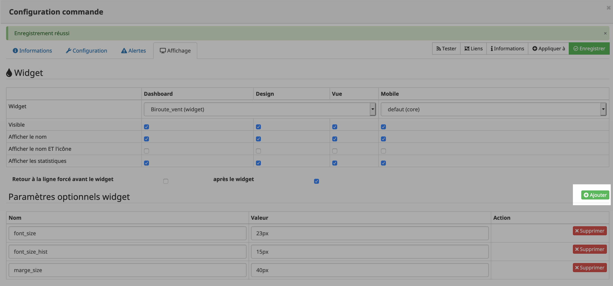

[back](./)
# Comment ajouter des paramètres

# Ajout des paramètres
Pour ajouter les paramètres, il faut se rendre dans le menu de la configuration de la commande

<blockquote>
    <ul>
        Cliquer ensuite sur le bouton <i>Ajouter</i>
        

        Ensuite renseigner les différents paramètres comme indiquer dans chaque widget
    </ul>
</blockquote>

# Changelog
<a href="https://github.com/JEALG/JEEDOM-Widget_JAG-doc/commits/master">Changelog DOC</a>

[back](./)