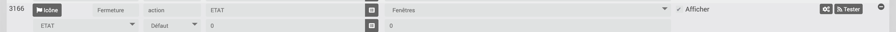
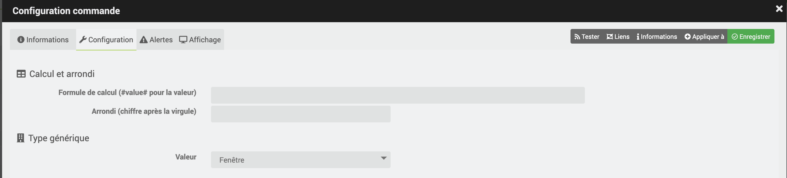
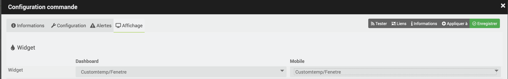
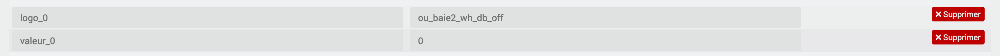
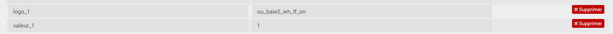
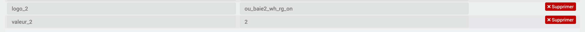

[back](./)
Voici un exemple de configuration
<blockquote>
        <li><b>Ma config</b> : 1 baie avec 2 capteurs</li>
</blockquote>

# Paramétrage Virtuel
<blockquote>
Tout d'abord j'ai créé un virtuel avec comme configs :
    <ul>
        <li>Avec une <i>info virtuelle</i> avec le nom <i>Fenêtre</i> : Cette info aura juste la fonction d'affichage</li>
        
        <li>Avec une <i>commande virtuelle</i> avec le nom <i>Ouv-G</i> : Correspond à l'état de la fenêtre de gauche ouverte, j'affecte les valeurs suivantes :
            <ul>
                <li><b>ETAT</b> aura la valeur 1</li>
                <li><b>Fenêtres</b> aura la valeur 1</li>
            </ul>
        </li>
        
        <li>Avec une <i>commande virtuelle</i> avec le nom <i>Ouv-D</i> : Correspond à l'état de la fenêtre de droite ouverte, j'affecte les valeurs suivantes :
            <ul>
                <li><b>ETAT</b> aura la valeur 1</li>
                <li><b>Fenêtres</b> aura la valeur 2</li>
            </ul>
        </li>
        
        <li>Avec une <i>commande virtuelle</i> avec le nom <i>Ouv-D_G</i> : Correspond à l'état des 2 fenêtres ouvertes, j'affecte les valeurs suivantes :
            <ul>
                <li><b>ETAT</b> aura la valeur 1</li>
                <li><b>Fenêtres</b> aura la valeur 3</li>
            </ul>
        </li>
        
        <li>Avec une <i>commande virtuelle</i> avec le nom <i>Fermeture</i> : Correspond à l'état des 2 fenêtres fermées, j'affecte les valeurs suivantes :
            <ul>
                <li><b>ETAT</b> aura la valeur 0</li>
                <li><b>Fenêtres</b> aura la valeur 0</li>
            </ul>
        </li>
        
        <li>Avec une <i>info virtuelle</i> avec le nom <i>ETAT</i> : Cette info sera créer automatiquement lors de la création des commandes, elle servira pour l'ensemble de mes scénarios</li>
        
    </ul>
</blockquote>
<blockquote>
et j'ai configuré l'etat <b>Fenêtres</b>
    <ul>
        <li>Dans l'onglet <i>configuration</i> dans la partie <i>Type générique</i> : j'affecte la valeur <i>Fenêtre</i></li>
        
        <li>Dans l'onglet <i>configuration</i> dans la partie <i>Affichage</i> : j'affecte les paramétres suivants :
            <ul>
                <li><b>Widget</b> j'affecte le widget</li>
                
                <li><b>Paramètres optionnels widget</b> j'ajoute les valeurs :
                    <ul>
                        <li><b>Pour l'état 0</b> j'affecte les valeurs suivantes
                            <ul>
                                <li><b>logo_0 : </b>ou_baie2_wh_db_off</li>
                                <li><b>valeur_0 : </b>0</li>
                                
                            </ul>
                        </li>
                        <li><b>Pour l'état 1</b> j'affecte les valeurs suivantes
                            <ul>
                                <li><b>logo_1 : </b>ou_baie2_wh_lf_on</li>
                                <li><b>valeur_1 : </b>1</li>
                                
                            </ul>
                        </li>
                        <li><b>Pour l'état 2</b> j'affecte les valeurs suivantes
                            <ul>
                                <li><b>logo_2 : </b>ou_baie2_wh_rg_on</li>
                                <li><b>valeur_2 : </b>2</li>
                                
                            </ul>
                        </li>
                        <li><b>Pour l'état 3</b> j'affecte les valeurs suivantes
                            <ul>
                                <li><b>logo_3 : </b>ou_baie2_wh_db_on</li>
                                <li><b>valeur_3 : </b>3</li>
                                
                            </ul>
                        </li>
                    </ul>
                </li>
            </ul>
        </li>
    </ul>
</blockquote>

# Paramétrage Scénario
<blockquote>
Ensuite j'ai créer un scénario avec le paramétrage suivant
</blockquote>

[back](./)