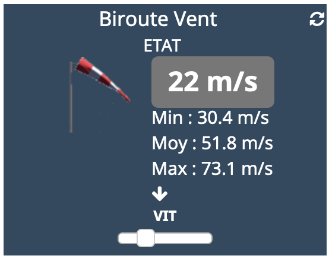

[back](./)
# Info importante
<blockquote>
    <ul>
        $A la date d'écriture de la documentation, ce paramétrage ne fonctionne pas sur le Core V4
    </ul>
</blockquote>

# Modification de la taille du texte
<blockquote>
    Il est possible de modifier la taille du textes de la valeur et de l'historique sur certains widgets de type Info.
</blockquote>

# Les variables
<blockquote>
    <ul>
        <li><b>font_size</b> : Modification de la taille de la valeur <i>(Valeur par défaut : 11px)</i></li>
        <li><b>font_size_hist</b> : Modification de la taille de la valeur de l'historique <i>(Valeur par défaut : 10px)</i></li>
        <li><b>marge_size</b> : Modification de la marge entre la valeur et l'historique <i>(Valeur par défaut :)</i></li>
    </ul>
</blockquote>

# Exemple

    <TABLE width="60%">
        <TR>
            <th scope="col" width="50%">Exemple</th>
            <th scope="col" width="50%">Valeur</th>
        </TR>
        <TR>
            <TD width="50%">Taille normale</TD>
            <TD width="50%" align="center"></TD>
        </TR>
        <TR>
            <TD width="50%">Exemple avec la variable **font_size ** = **22px**</TD>
            <TD width="50%" align="center"></TD>
        </TR>
    </TABLE>

# Autres paramétrages possible et Aide
<blockquote>
    <ul>
        <li><a href="HELP_config_info.html">Aide ajout Des paramètres pour un widget Info</a></li>
        <li><a href="HELP_Error.html">Paramétrage image de défaut</a></li>
        <li><a href="HELP_stats.html">Afficher les statistiques</a></li>
        <li><a href="HELP_para.html">Ajouter les paramètres sur un widget</a></li>
    </ul>
</blockquote>

[back](./)