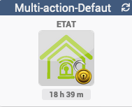
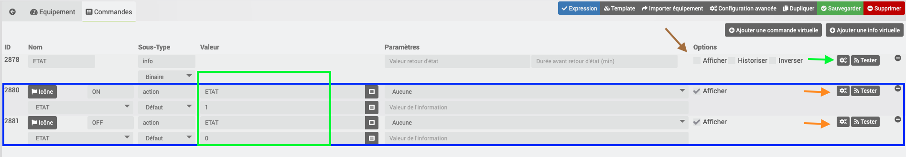
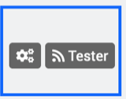
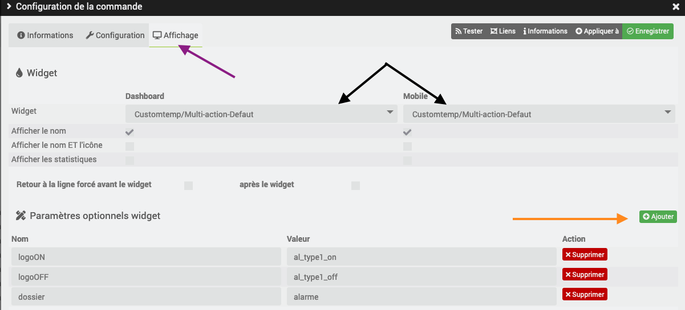

[back](./)
# Aide pour le paramétrage des widgets de type action

Une vidéo pour aider les nuls <a href="https://www.youtube.com/watch?v=wiMh8rmfdKU">Virtuel pour les nuls</a>

Ici l'exemple d'un équipement fait avec le plugin Virtuel

# Paramétrage de l'équipement

* <b>La flèche Marron</b> : Action du widget
    * Options : il est possible de cocher ou pas <i>Afficher</i> (je conseille de décocher)

* <b>En Bleu</b> : les boutons
	* Type : Sélectionner action
	* Sous-Type : Défaut
    * Options : Cocher la case Afficher
	* Roue cranté : permet de choisir le type de widget et les options (fléche orange)
    * Sous les commandes : Il faut absolument sélectionner le nom de l'état pour que le widget fonctionne (carré vert)

# Choix du widget
* Cliquer sur la roue crantée

* Ensuite sélectionner l'onglet <b><i>Affichage</i></b> (flèche en violet) 

 

* Ensuite sélectionner le widget <b><i>Multi-action-Defaut</i></b> (flèche en noir) pour la représentation <i>Dashboard</i> et <i>Mobile</i> 

## Exemple de paramétrage
Voici l'exemple voulu

## Ajout des paramètres
* Ajouter les variables ci-dessous en cliquant sur le bouton <b><i>Ajouter</i></b> (flèche en orange) sur chaque commande 

 

### Pour la commande <b>Etat</b>
Vu que cette commande n'est pas affichée, le paramétrage sera laissé en <b>Défaut</b>

### Pour la commande <b>ON et OFF</b>
Les paramètres suivants seront mis d'abord pour la commande <b>ON</b>

* <b>Widget</b> : Choix du widget
    * Dashboard : Customtemp/Multi-action-Defaut
    * mobile : Customtemp/Multi-action-Defaut

* <b>Paramètres optionnels widget </b> : les variables ci-dessous seront ajouté en cliquant sur le bouton <i>Ajouter</i>

    <TABLE width="60%">
        <TR>
            <th scope="col" width="50%">Nom</th>
            <th scope="col" width="50%">Valeur</th>
        </TR>
        <TR>
            <TD width="50%">logoON</TD>
            <TD width="50%">al_type1_on</TD>
        </TR>
        <TR>
            <TD width="50%">logoOFF</TD>
            <TD width="50%">al_type1_off</TD>
        </TR>
        <TR>
            <TD width="50%">dossier</TD>
            <TD width="50%">alarme</TD>
        </TR>
        <TR>
            <TD width="50%">logoTime</TD>
            <TD width="50%">duree</TD>
        </TR>
    </TABLE>

 

Répéter la même opération sur la commande <b>OFF</b> ou cliquer sur le bouton <b>Appliquer à</b> et sélectionner la commande

# Changelog
<a href="https://github.com/JEALG/JEEDOM-Widget_JAG-doc/commits/master">Changelog DOC</a>

[back](./)