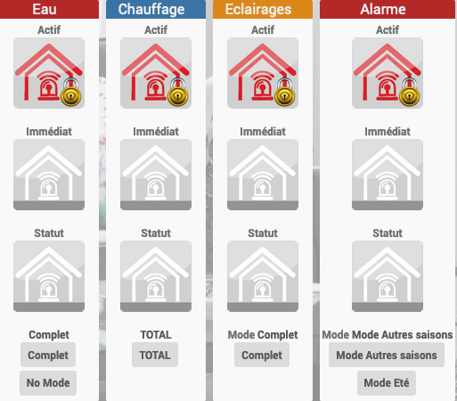
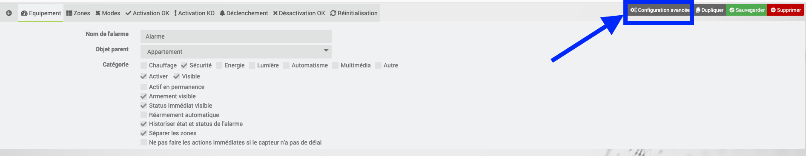
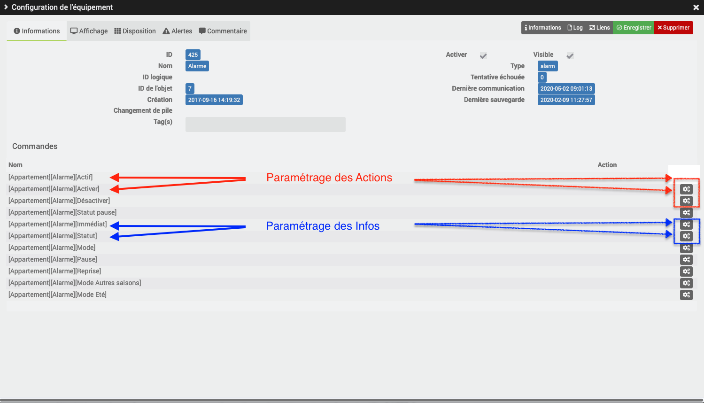
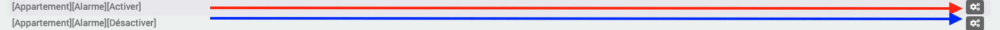
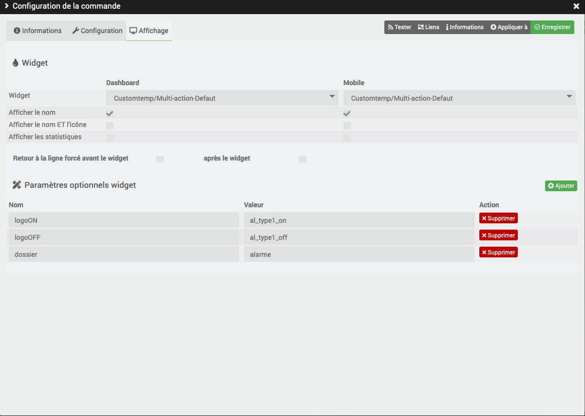
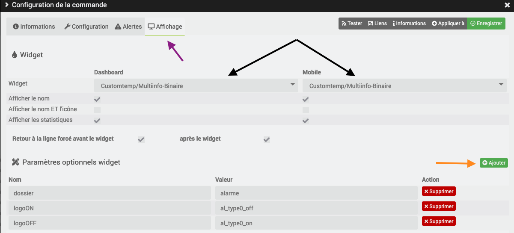

[back](./)

# Aide pour le paramétrage des widgets **Multi-action** et **Multi-info** avec le plugin Alarme
Ici l'exemple d'un équipement fait avec le plugin Alarme

Pour paramétrer les infos des widgets, il faut sur ce plugin cliquer sur <b><i>Configuration Avancée</i></b>

Le paramétrage va se faire en plusieurs étapes
* <b>En rouge </b>: Le paramétrage des actions
* <b>En bleu </b>: Le paramétrage des infos

# Widgets nécessaire
Pour faire cet affichage vous avez besoin.

Dans chaque widget, vous avez un lien pour télécharger les sources

## Dashboard

Nom du Widget | Exemple | Docs/Téléchargement
--- | --- | ---
**Multi-action** | | <a href="./WIDGET_d_Multi_action_Defaut.html">Lien</a>
**Multi info - Binaire** | | <a href="./WIDGET_d_Multi_info_Binaire.html">Lien</a>

## Mobile

Nom du Widget | Exemple | Docs/Téléchargement
--- | --- | ---
**Multi-action** | | <a href="./WIDGET_m_Multi_action_Defaut.html">Lien</a>
**Multi info - Binaire** | | <a href="./WIDGET_m_Multi_info_Binaire.html">Lien</a>

# Paramétrage des actions

* Cliquer sur la roue crantée en face de la commande <b>Activer</b>  (flèche en jaune)

* Ensuite sélectionner l'onglet <b><i>Affichage</i></b> (flèche en violet) 

 

* Ensuite sélectionner le widget <b><i>Multi-action-Defaut</i></b> (flèche en noir) pour la représentation <i>Dashboard</i> et <i>Mobile</i> 
* Ajouter les variables ci-dessous en cliquant sur le bouton <b><i>Ajouter</i></b> (flèche en orange) 

    <TABLE width="60%">
        <TR>
            <th scope="col" width="50%">Nom</th>
            <th scope="col" width="50%">Valeur</th>
        </TR>
        <TR>
            <TD width="50%">logoON</TD>
            <TD width="50%">al_type1_on</TD>
        </TR>
        <TR>
            <TD width="50%">logoOFF</TD>
            <TD width="50%">al_type1_off</TD>
        </TR>
        <TR>
            <TD width="50%">dossier</TD>
            <TD width="50%">alarme</TD>
        </TR>
    </TABLE>

* Répéter la même opération en cliquant sur la roue crantée en face de la commande <b>Désactiver</b>  (flèche en rose) ou cliquer sur le bouton <b>Appliquer à</b> et sélectionner la commande

# Paramétrage des infos

* Cliquer sur la roue crantée en face de la commande <b>Immédiat</b>  (flèche en jaune)

* Ensuite sélectionner l'onglet <b><i>Affichage</i></b> (flèche en violet) 

 

* Ajouter les variables ci-dessous en cliquant sur le bouton <b><i>Ajouter</i></b> (flèche en orange) 

    <TABLE width="60%">
        <TR>
            <th scope="col" width="50%">Nom</th>
            <th scope="col" width="50%">Valeur</th>
        </TR>
        <TR>
            <TD width="50%">logoON</TD>
            <TD width="50%">al_type0_off</TD>
        </TR>
        <TR>
            <TD width="50%">logoOFF</TD>
            <TD width="50%">al_type0_on</TD>
        </TR>
        <TR>
            <TD width="50%">dossier</TD>
            <TD width="50%">alarme</TD>
        </TR>
    </TABLE>

* Répéter la même opération en cliquant sur la roue crantée en face de la commande <b>Statut</b>  (flèche en rose) ou cliquer sur le bouton <b>Appliquer à</b> et sélectionner la commande

# Changelog
<a href="https://github.com/JEALG/JEEDOM-Widget_JAG-doc/commits/master">Changelog DOC</a>

[back](./)