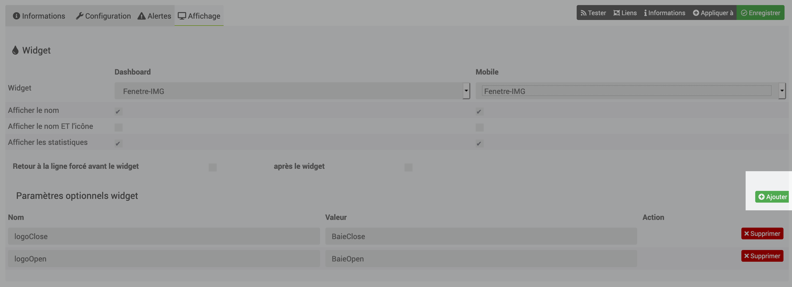

[back](./)
# Aide pour le paramétrage des widgets de type info (binaire, numérique) et de de type action avec l'utilisation du plugin Alarmw

Ici l'exemple d'un équipement fait avec le plugin Alarme, Pour paramétrer les infos, il faut sur ce plugin cliquer sur "Configuration Avancée"

Le paramétrage va se faire en plusieurs étapes

* Paramétrage des actions
* Paramétrage des infos

# Paramétrage des actions

## Pour la commande "Activer"

* Cliquer sur la roue crantée en face de la commande <b> Fléche en rouge </b>
* Ensuite dans l'onglet paramétrer les infos suivantes dans l'onglet <b><i>"Affichage"</i></b> 

 

* Ajouter les variables ci-dessous en cliquant sur le bouton <b><i>"Ajouter"</i></b> 

    <TABLE width="60%">
        <TR>
            <TD width="50%">Nom</TD>
            <TD width="50%">Valeur</TD>
        </TR>
        <TR>
            <TD width="50%">logoON</TD>
            <TD width="50%">al_type1_on</TD>
        </TR>
        <TR>
            <TD width="50%">logoOFF</TD>
            <TD width="50%">al_type1_off</TD>
        </TR>
        <TR>
            <TD width="50%">dossier</TD>
            <TD width="50%">alarme</TD>
        </TR>
    </TABLE>

* <b>En Rouge</b> : Sous types
	* Type : info
	* Sous-Type : Binaire

* <b>En vert</b> : Options
    * Afficher : Cocher cette case
    * Historiser : Permet d'historiser l'équipement (En option suivant les besoins)

* <b>En bleue</b> : Options
    * roue cranté permet de choisir le type de widget et les options

## Exemple de paramétrage
Voici l'exemple voulu

## Les commandes d'action
voir l'exemple dans la doc <a href="HELP_config_action.html">Aide pour le paramétrage des widgets de type action</a>

# Choix du widget
Cliquer sur la roue crantée (voir image ci-dessous),

Cliquer sur affichage, sélectionner ensuite le widget voulu dans la partie bleu (grâce à la liste déroulante)

# Ajout des paramètres
Cliquer sur le bouton <i>Ajouter</i> pour ajouter les différents paramètres du widget, ensuite se référer sur chacun des widgets pour avoir les variables

# Changelog
<a href="https://github.com/JEALG/JEEDOM-Widget_JAG-doc/commits/master">Changelog DOC</a>

[back](./)