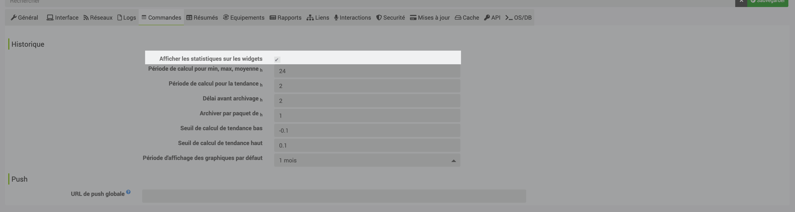

[back](./)
# Affichage de l'historique

# Activation de l'historique
Il est impératif que l'info de l'équipement soit historisé pour être afficher

# Afficher les statistiques sur les widgets
Il faut vérifier que la case "Afficher les statistiques sur les widgets" soit coché dans la configuration de Jeedoom

# Afficher les statistiques sur le widget
Dans les réglages de chaque commande, Cliquer sur la roue crantée de la commande

Ensuite cocher <i>Afficher les statistiques</i> soit pour le Dashboard soit pour le mobile soit pour les 2 dans l'onglet <b>Affichage</b>

# Changelog
<a href="https://github.com/JEALG/JEEDOM-Widget_JAG-doc/commits/master">Changelog DOC</a>

[back](./)