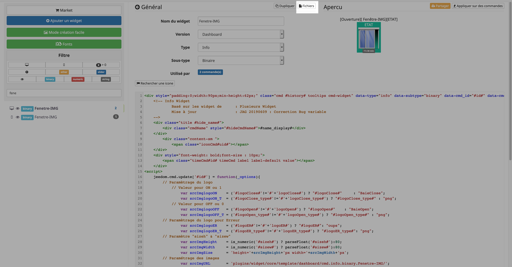
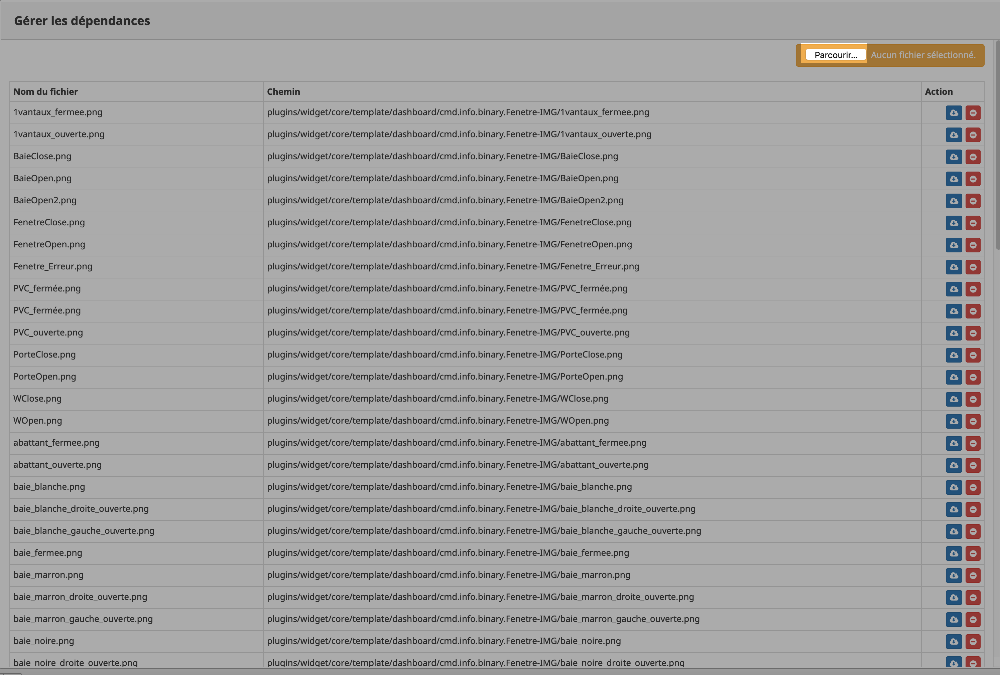

[back](./)
# Ajouter des images dans un widget avec le core V3
Il est possible d'ajouter des images dans un widget <i>Celle-ci ne sera pas effacer à la mise à jour du widget</i>
<blockquote>
    <ul>
        <li>Il faut ce rendre dans le plugin Widget et sélectionner le widget voulu et cliquer sur <i><b>Fichiers</b></i></li>
    </ul>
</blockquote>

<blockquote>
    <ul>
        <li>Cliquez sur <i><b>Parcourir et sélectionner les images voulu</b></i></li>
    </ul>
</blockquote>

   
    

# Télécharger les sources

# Chancelog
<a href="https://github.com/JEALG/JEEDOM-Widget_JAG-doc/commits/master">Changelog DOC</a>

[back](./)
