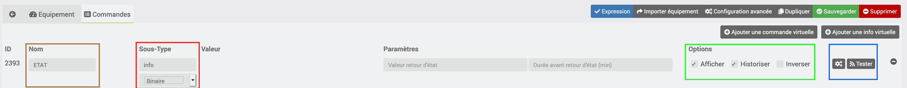

[back](./)
# Aide pour le paramétrage des widgets de type info (binaire, numérique)
    
Ici l'exemple d'un équipement fait avec le plugin Virtuel, il faut paramétrer les infos suivantes :

# Paramétrage de l'équipement

## La commande d'info
* <b>En marron</b> : Nom de la commande
    
* <b>En Rouge</b> : Sous types
	* Type : info
	* Sous-Type : Binaire
    
* <b>En vert</b> : Options
    * Afficher : Cocher cette case
    * Historiser : Permet d'historiser l'équipement (En option suivant les besoins)

* <b>En bleue</b> : Options
    * roue cranté permet de choisir le type de widget et les options

## Les commandes d'action
voir l'exemple dans la doc <a href="JEEDOM_AIDE_CONFIG_ACTION.html">Aide pour le paramétrage des widgets de type action</a>

# Choix du widget
Cliquer sur la roue crantée (voir image ci-dessous), cliquer sur affichage, sélectionner ensuite le widget voulu

# Ajout des paramétres
Cliqur sur le bouton <i>Ajouter</i> pour ajouter les différents paramétres du widget, ensuite se référer sur chacun des widgets pour avoir les variables

# Télécharger les sources

# Changelog
<a href="https://github.com/JEALG/JEEDOM-Widget_JAG-doc/commits/master">Changelog DOC</a>

[back](./)