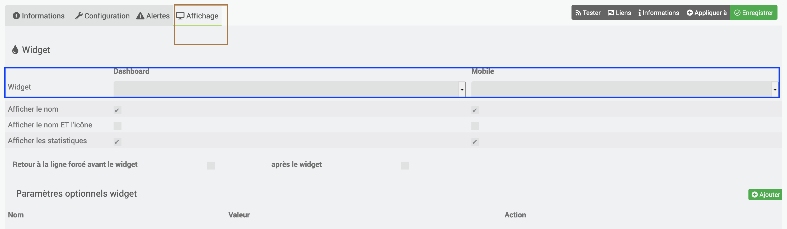
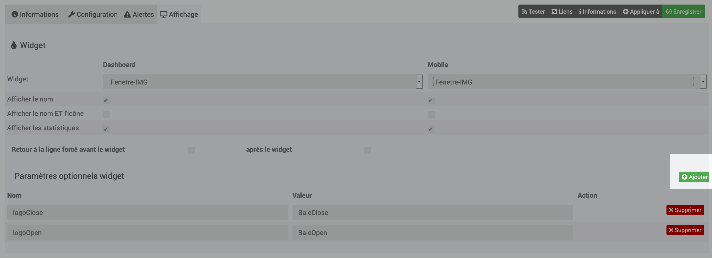

[back](./)
# Aide pour le paramétrage des widgets de type info (binaire, numérique)

# Paramétrage de l'équipement
Ici l'exemple d'un équipement fait avec le plugin info; il faut paramétrer les infos suivantes

<blockquote>
        <ul>
            <li><b>En marron</b> : Nom de la commande</li>
            <li><b>En rouge</b> :  	Sous-Type</li>
            <ul>
                <li>Type : Sélectionner infos</li>
                <li>Sous-Type : Sélectionner le sous type (dans l'exemple "binaire") cela permettra de choisir le widget dédié</li>
            </ul>
            <li><b>En vert</b> : Options</li>
            <ul>
                <li>Afficher : Permet d'afficher l'info sur le dashboard ou sur le mobile</li>
                <li>Historiser : Permet d'historiser l'équipement</li>
            </ul>
            <li><b>En bleu</b> : roue cranté permet de choisir le type de widget et les options</li>
        </ul>
</blockquote>

# Choix du widget
Cliquer sur la roue crantée (voir image ci-dessous), cliquer sur affichage, sélectionner ensuite le widget voulu

# Ajout des paramétres
Cliqur sur le bouton <i>Ajouter</i> pour ajouter les différents paramétres du widget, ensuite se référer sur chacun des widgets pour avoir les variables

# Télécharger les sources

# Chancelog
<a href="https://github.com/JEALG/JEEDOM-Widget_JAG-doc/commits/master">Changelog DOC</a>

[back](./)