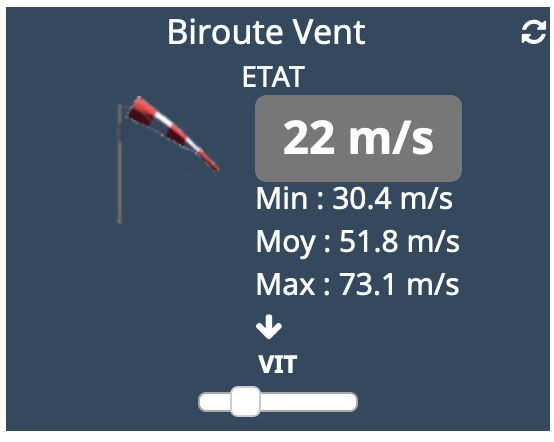
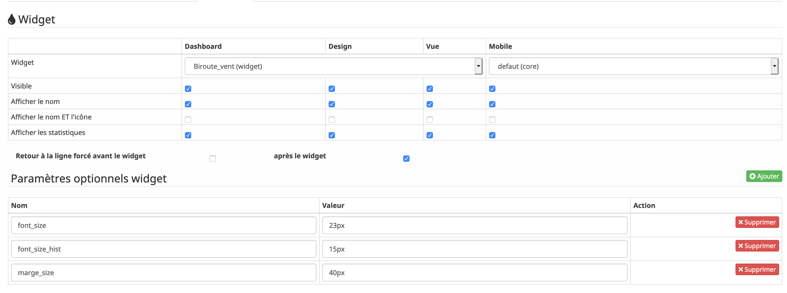

[back](./)
# Modification de la taille du texte
<blockquote>
    Il est possible de modifier la taille du textes de la valeur et de l'historique sur certains widgets de type Info
</blockquote>

# Les variables
<blockquote>
        <ul>
            <li><b>font_size</b> : Modification de la taille de la valeur <i>(Valeur par défaut : 11px)</i></li>
            <li><b>font_size_hist</b> : Modification de la taille de la valeur de l'historique <i>(Valeur par défaut : 10px)</i></li>
            <li><b>marge_size</b> : Modification de la marge entre la valeur et l'historique <i>(Valeur par défaut :)</i></li>
        </ul>
</blockquote>

# Exemple
<blockquote>
    <ul>
        <li><b>Taille normale</b></li>
        

        <li><b>Taille normale</b></li>
        

        

        </ul>
</blockquote>

# Info importante
<blockquote>
        <ul>
A la date d'écriture de la documentation, ce paramétrage ne fonctionne pas sur le Core V4
        </ul>
</blockquote>

# Autres paramétrages possible et Aide
<blockquote>
        <ul>
            <li><a href="JEEDOM_AIDE_CONFIG_INFO.html">Aide ajout Des paramétres pour un widget Info</a></li>
            <li><a href="JEEDOM_AIDE_Error.html">Paramétrage image de défaut</a></li>
            <li><a href="JEEDOM_AIDE_STATS.html">Afficher les statistiques</a></li>
            <li><a href="JEEDOM_AIDE_PARA.html">Ajouter les paramétres sur un widget</a></li>
        </ul>
</blockquote>

# Télécharger les sources

# Changelog
<a href="https://github.com/JEALG/JEEDOM-Widget_JAG-doc/commits/master">Changelog DOC</a>

[back](./)