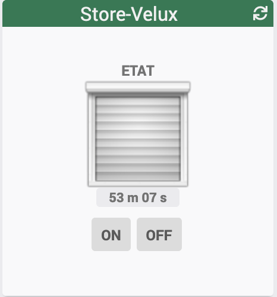

[back](../JEEDOM_Archive_info_binaire.html)
# Widget "Store_IMG" 
Widget pour Jeedom permettant d'afficher une icône pour une fonction de type <b>info binaire</b>

# A savoir
<blockquote>
<b>Afin de simplifier la gestion des images, depuis le 10/09/2019, il est necessaire d'avoir le widget "Multi_action-Defaut"</b>
</blockquote>
# Nouveau paramétrage
## Remplacer par le widget
Ce widget est remplacé par : <a href="JEEDOM_Multi_info_Binaire_mobile.html">Widget Mobile : <b>Multi info - Binaire (mobile)</b></a>

## Paramétrage
Pour avoir le même  paramétrage par défaut du widget Store_IMG, il faudra ajouter les variables suivante :
* <b>dossier</b> avec la valeur : <i>store</i>
* <b>logoON</b> avec la valeur : <i>st_volet_pos0</i>
* <b>logoOFF</b> avec la valeur : <i> st_volet_pos99</i>
* <b>Les autres variables sont identiques</b>

<dl>
    <a href="https://github.com/JEALG/JEEDOM-Store-Velux-num/commits/master">Changelog WIDGET</a> 
    <a href="https://github.com/JEALG/JEEDOM-Widget_JAG-doc/commits/master">Changelog DOC</a>
</dl>

[back](../JEEDOM_Archive_info_binaire.html)