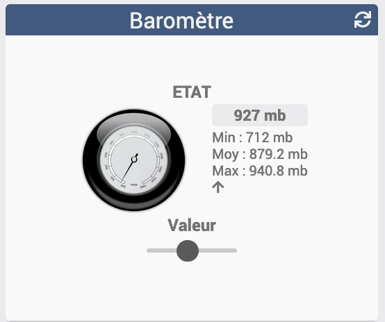
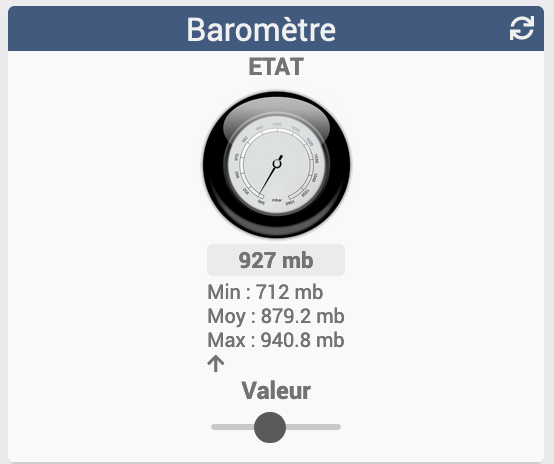

[back](./)
# Widget "Baromètre"

Widget pour Jeedom permettant d'afficher une icône pour une fonction de type <b>info binaire</b>

# A savoir
<blockquote>
<b>Afin de simplifier la gestion des images, depuis le 10/09/2019, il est necessaire d'avoir le </b><a href="WIDGET_d_Multi_action_Defaut">Widget Dashboard : <b>Multi-action</b></a>
</blockquote>

# Paramétrage
## Choix de l'icône
Pour choisir le type de visuel à afficher, il faut ajouter les paramètres optionnels suivant :
<blockquote>
        <ul>
            <li><b>logo</b> : Permet de choisir l'image pour la valeur <i>(valeur par défaut : st_banne_pos)</i></li>
            <li><b>logo_type</b> : Permet de choisir <i>l'extension</i> pour l'icône/image <i>logo</i> (par exemple: 'gif', 'jpg', etc.....)<i> (valeur par défaut : png)</i></li>
        </ul>
</blockquote>
## Taille des images ou des icônes
Il est possible de spécifier la hauteur et la largeur des icônes ou images par l'ajout des paramètres optionnels suivant :
<blockquote>
        <ul>
            <li><b>sizeh</b> : Permet de choisir la hauteur de l'image <i>(valeur par défaut : 80)</i></li>
            <li><b>sizew</b> : Permet de choisir la largeur de l'image <i>(valeur par défaut : 83)</i></li>
        </ul>
</blockquote>

## Position Légende
Il est possible de déplacer la légende
<blockquote>
        <ul>
            <li><b>leg_pos</b> = right <i>(valeur par défaut)</i></li>
            

            <li><b>leg_pos</b> = left</li>
            

            <li><b>leg_pos</b> = bottom</li>
            

        </ul>
</blockquote>

## Autres paramétrages possible et Aide
<blockquote>
        <ul>
            <li><a href="JEEDOM_AIDE_CONFIG_INFOS.html">Aide ajout Des paramètres pour un widget Info</a></li>
            <li><a href="JEEDOM_AIDE_CONFIG_html">Paramétrage image de défaut</a></li>
            <li><a href="JEEDOM_AIDE_CONFIG_STATS.html">Afficher les statistiques</a></li>
            <li><a href="JEEDOM_AIDE_CONFIG_PARA.html">Ajouter les paramétres sur un widget</a></li>
        </ul>
</blockquote>

### Ajout d'image

<blockquote>
        Il est possible d'inclure d'autres icônes dans le widget. 
        Le nommage des images est normalisé et doit respecter le format suivant :
        <ul>
            <li><b>Image</b> : type_x</li>
            <li><i>Remplacer <b>type</b> par le nom de l'image</i></li>
            <li><i>Remplacer <b>x</b> par le niveau (Valeur possible : 940, 950, 960, 970, 980, 990, 1000, 1010, 1020, 1030, 1040, 1050, 1060)</i></li>
        </ul>
         <ul>
            <li><a href="JEEDOM_AIDE_ADD_IMG.html">Ajouter des images dans un widget</a></li>
        </ul>
</blockquote>

# Télécharger les sources
<li><a href="https://github.com/JEALG/JEEDOM-Barometre/tree/masterv4">Télécharger les sources pour la V4</a></li>
<li><a href="https://github.com/JEALG/JEEDOM-Barometre/tree/master">Télécharger les sources pour la V3</a></li>

# Changelog
<a href="https://github.com/JEALG/JEEDOM-Barometre/commits/masterv4">Changelog WIDGET pour le Core V4</a> 
<a href="https://github.com/JEALG/JEEDOM-Barometre/commits/master">Changelog WIDGET pour le Core V3</a> 
<a href="https://github.com/JEALG/JEEDOM-Widget_JAG-doc/commits/master">Changelog DOC</a>

[back](./)