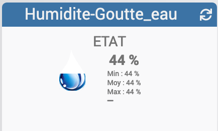

[back](./)
**Widget "Humidite-Goutte_eau (mobile)** 

<h4 id="A Savoir">A savoir</h4>
<blockquote>
<b>Afin de simplifier la gestion des images, depuis le 10/09/2019, il est necessaire d'avoir le widget "Multi_action-Defaut"</b>
</blockquote>

Widget pour Jeedom permettant d'afficher une icône pour une fonction de type <b>info numérique</b>

<h4 id="A Savoir">A savoir</h4>
<blockquote>
<b>Afin de simplifier la gestion des images, depuis le 10/09/2019, il est necessaire d'avoir le widget "Multi_action-Defaut"</b>
</blockquote>

<h4 id="Aide">Autres paramétrages possible et Aide</h4>
<blockquote>
        <ul>
            <li><a href="./aide/JEEDOM_AIDE_CONFIG_INFOS.html">Aide ajout Des paramétres pour un widget Info</a></li>
            <li><a href="./aide/JEEDOM_AIDE_Error.html">Paramétrage image de défaut</a></li>
            <li><a href="./aide/JEEDOM_AIDE_STATS.html">Afficher les statistiques</a></li>
            <li><a href="./aide/JEEDOM_AIDE_PARA.html">Ajouter les paramétres sur un widget</a></li>
        </ul>
</blockquote>

<dl>
    <a href="https://github.com/JEALG/JEEDOM-Humidite-Goutte_eau--Mobile/tree/masterv4">Télécharger les sources pour la V4</a> 
    <a href="https://github.com/JEALG/JEEDOM-Humidite-Goutte_eau--Mobile/commits/masterv4">Changelog WIDGET pour le Core V4</a> 
    <a href="https://github.com/JEALG/JEEDOM-Humidite-Goutte_eau--Mobile/commits/master">Changelog WIDGET pour le Core V3</a> 
    <a href="https://github.com/JEALG/JEEDOM-Widget_JAG-doc/commits/master">Changelog DOC</a>
</dl>

[back](./)