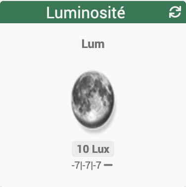

[back](./)
# Widget "Luminosité-IMG-Mini (mobile)

Widget pour Jeedom permettant d'afficher une icône pour une fonction de type <b>info numérique</b>

## A savoir
<blockquote>
<b>Afin de simplifier la gestion des images, depuis le 10/09/2019, il est necessaire d'avoir le widget "Multi_action-Defaut"</b>
</blockquote>

## Paramétrage
<h4 id="Taille">Taille des images ou des icônes</h4>
Il est possible de spécifier la hauteur et la largeur des icônes ou images par l'ajout des paramètres optionnels suivant :
<blockquote>
        <ul>
            <li><b>Pourcentage-M</b> : Permet de choisir la taille en "px" ou "%" <i>(valeur par défaut : NO donc "px")</i></li>
            <ul>
                <li><i>Pourcentage-M = NO</i> la taille sera en "px"</li>
                <li><i>Pourcentage-M = YES</i> la taille sera en "%"</li>
            </ul>
            <li><b>sizeh-M</b> : Permet de choisir la hauteur de l'image <i>(valeur par défaut : 30)</i></li>
            <li><b>sizew-M</b> : Permet de choisir la largeur de l'image <i>(valeur par défaut : 30)</i></li>
        </ul>
</blockquote>

<h4 id="Level">Niveau</h4>
Il est possible de modifier les niveaux
<blockquote>
        <ul>
            <li><b>level_1</b> : Niveau Bas (nuit) <i>(valeur par défaut : 20)</i></li>
            <li><b>level_2</b> : Niveau Haut (jour) <i>(valeur par défaut : 100.0)</i></li>
        </ul>
</blockquote>
<h4 id="Aide">Autres paramétrages possible et Aide</h4>
<blockquote>
        <ul>
            <li><a href="./aide/JEEDOM_AIDE_CONFIG_INFOS.html">Aide ajout Des paramétres pour un widget Info</a></li>
            <li><a href="./aide/JEEDOM_AIDE_Error.html">Paramétrage image de défaut</a></li>
            <li><a href="./aide/JEEDOM_AIDE_STATS.html">Afficher les statistiques</a></li>
            <li><a href="./aide/JEEDOM_AIDE_PARA.html">Ajouter les paramétres sur un widget</a></li>
        </ul>
</blockquote>

## Télécharger les sources
<a href="https://github.com/JEALG/JEEDOM-Luminosite-IMG-Mini--mobile/tree/masterv4">Télécharger les sources pour la V4</a> 

## Chancelog
<a href="https://github.com/JEALG/JEEDOM-Luminosite-IMG-Mini--mobile/commits/masterv4">Changelog WIDGET pour le Core V4</a> 
<a href="https://github.com/JEALG/JEEDOM-Luminosite-IMG-Mini--mobile/commits/master">Changelog WIDGET pour le Core V3</a> 
<a href="https://github.com/JEALG/JEEDOM-Widget_JAG-doc/commits/master">Changelog DOC</a>

[back](./)