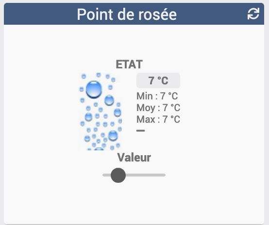
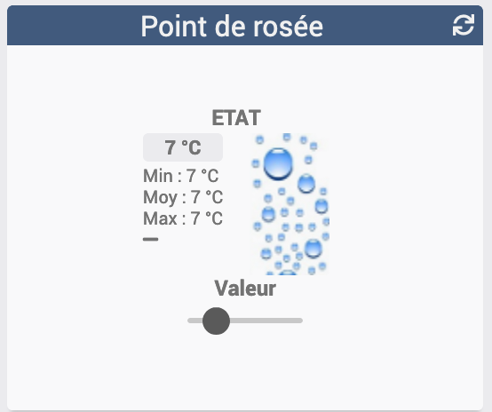
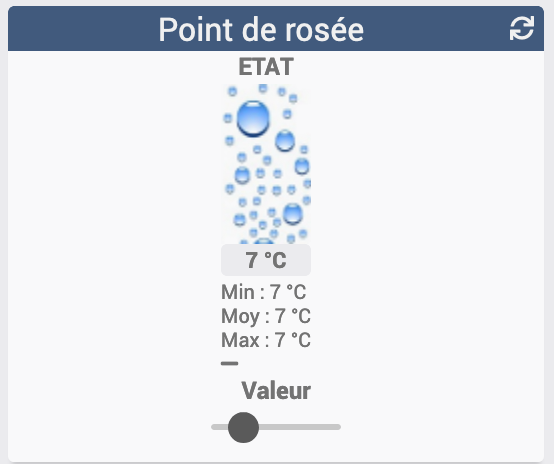

[back](./)
# Widget "Point de rosée"

<h4 id="A Savoir">A savoir</h4>
<blockquote>
<b>Afin de simplifier la gestion des images, depuis le 10/09/2019, il est necessaire d'avoir le widget "Multi_action-Defaut"</b>
</blockquote>

Widget pour Jeedom permettant d'afficher une icône pour une fonction de type <b>info numérique</b>

# A savoir
<blockquote>
<b>Afin de simplifier la gestion des images, depuis le 10/09/2019, il est necessaire d'avoir le </b><a href="JEEDOM_Multi_action_Defaut">Widget Dashboard : <b>Multi-action</b></a>
</blockquote>

# Paramétrage
## Taille des images ou des icônes
Il est possible de spécifier la hauteur et la largeur des icônes ou images par l'ajout des paramètres optionnels suivant :
<blockquote>
        <ul>
            <li><b>sizeh</b> : Permet de choisir la hauteur de l'image <i>(valeur par défaut : 80)</i></li>
            <li><b>sizew</b> : Permet de choisir la largeur de l'image <i>(valeur par défaut : 45)</i></li>
        </ul>
</blockquote>

## Position Légende
Il est possible de déplacer la légende
<blockquote>
        <ul>
            <li><b>leg_pos</b> = right <i>(valeur par défaut)</i></li>
            

            <li><b>leg_pos</b> = left</li>
            

            <li><b>leg_pos</b> = low</li>
            

        </ul>
</blockquote>
 
## Autres paramétrages possible et Aide
<blockquote>
        <ul>
            <li><a href="JEEDOM_AIDE_CONFIG_INFOS.html">Aide ajout Des paramétres pour un widget Info</a></li>
            <li><a href="JEEDOM_AIDE_Error.html">Paramétrage image de défaut</a></li>
            <li><a href="JEEDOM_AIDE_STATS.html">Afficher les statistiques</a></li>
            <li><a href="JEEDOM_AIDE_PARA.html">Ajouter les paramétres sur un widget</a></li>
        </ul>
</blockquote>

# Télécharger les sources
<a href="https://github.com/JEALG/JEEDOM-Point-rosee/tree/masterv4">Télécharger les sources pour la V4</a> 

# Changelog
<a href="https://github.com/JEALG/JEEDOM-Point-rosee/commits/masterv4">Changelog WIDGET pour le Core V4</a> 
<a href="https://github.com/JEALG/JEEDOM-Point-rosee/commits/master">Changelog WIDGET pour le Core V3</a> 
<a href="https://github.com/JEALG/JEEDOM-Widget_JAG-doc/commits/master">Changelog DOC</a>
    

[back](./)