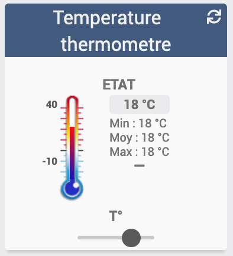
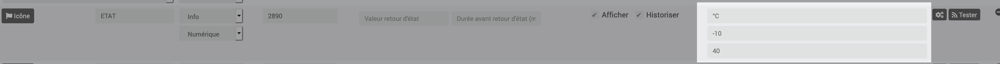

[back](./)
# Widget "Temperature thermometre"

Widget pour Jeedom permettant d'afficher une icône pour une fonction de type <b>info numérique</b>

# A savoir
<blockquote>
<b>Afin de simplifier la gestion des images, depuis le 10/09/2019, il est nécessaire d'avoir le </b><a href="WIDGET_d_Multi_action_Defaut">Widget Dashboard : <b>Multi-action</b></a>
</blockquote>

# Paramétrage
## Affichage de l'historique ou min max sur la gauche
<blockquote>
        <ul>
            <li><b>min_max</b> : Affiche par défaut le min et max configurer dans l'équipement <i>(valeur par défaut : X)</i></li>
            

            <li><b>min_max</b> : utilise le maxi et le mini de l'historique, <i>la variable doit ête vide</i></li>
        </ul>
</blockquote>

## Taille du texte
<blockquote>
        <ul>
            Il est possible sur ce widget de modifier la taille du texte, cette fonction ne fonctionne qu'avec le Core V3
            <a href="HELP_SIZE.html">Changer la Taille du texte de l'historique</a>
        </ul>
</blockquote>

## Autres paramétrages possible et Aide
<blockquote>
        <ul>
            <li><a href="HELP_CONFIG_INFOS.md">Aide ajout Des paramétres pour un widget Info</a></li>
            <li><a href="HELP_Error.html">Paramétrage image de défaut</a></li>
            <li><a href="HELP_STATS.html">Afficher les statistiques</a></li>
            <li><a href="HELP_PARA.html">Ajouter les paramétres sur un widget</a></li>
        </ul>
</blockquote>

# Télécharger les sources
><a href="HELP_Install_Manu.html">Aide pour l'installation manuelle des widgets</a></li>
 
<li><a href="https://github.com/JEALG/JEEDOM-Thermometre/tree/masterv4">Télécharger les sources du Widget pour le Core V4</a></li>
<li><a href="https://github.com/JEALG/JEEDOM-Thermometre/tree/master">Télécharger les sources du Widget pour le Core V3</a></li>

# Changelog
<a href="https://github.com/JEALG/JEEDOM-Thermometre/commits/masterv4">Changelog WIDGET pour le Core V4</a> 
<a href="https://github.com/JEALG/JEEDOM-Thermometre/commits/master">Changelog WIDGET pour le Core V3</a> 
<a href="https://github.com/JEALG/JEEDOM-Widget_JAG-doc/commits/master">Changelog DOC</a>

[back](./)