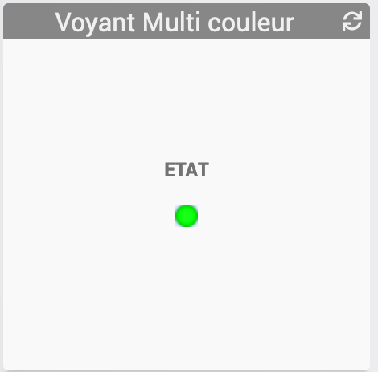

[back](./)
# Widget "VoyantMulticouleur : Bouton en forme de voyant Multi couleur"

Widget pour Jeedom permettant d'afficher une icône pour une fonction de type <b>info binaire</b>

<blockquote>
Le widget inclus d'office 14 types d'icônes.
</blockquote>

# A savoir
<blockquote>
<b>Afin de simplifier la gestion des images, depuis le 10/09/2019, il est necessaire d'avoir le </b><a href="JEEDOM_Multi_action_Defaut">Widget Dashboard : <b>Multi-action</b></a>
</blockquote>

# Paramétrage
## Choix de la couleur
Pour choisir la couleur, il faut ajouter les paramètres optionnels suivant :
<blockquote>
        <ul>
            <li><b>CouleurON</b> : Permet de choisir la couleur du voyant pour la valeur ON <i>(valeur par défaut : GN)</i></li>
            <li><b>CouleurOFF</b> : Permet de choisir la couleur du voyant pour la valeur OFF <i>(valeur par défaut : RD)</i></li>
            <li><b>Les valeurs possibles </b> : BK, BU, GN, OR, RD, WH, YE</li>
        </ul>
</blockquote>

## Choix de la forme
Pour choisir la forme, il faut ajouter les paramètres optionnels suivant :
<blockquote>
        <ul>
            <li><b>FormeON</b> : Permet de choisir la forme du voyant pour la valeur ON <i>(valeur par défaut : ROND)</i></li>
            <li><b>FormeOFF</b> : Permet de choisir la forme du voyant pour la valeur OFF <i>(valeur par défaut : ROND)</i></li>
            <li><b>Les valeurs possibles</b> : ROND, CARRE</li>
        </ul>
</blockquote>

## Choix de l'extension
Pour choisir le type d'extension de l'image
<blockquote>
        <ul>
            <li><b>logoON_type</b> : Permet de choisir <i>l'extension</i> pour l'icône/image <i>logoON</i> (par exemple: 'gif', 'jpg', etc.....)<i> (valeur par défaut : png)</i></li>
            <li><b>logoOFF_type</b> : Permet de choisir <i>l'extension</i> pour l'icône/image <i>logoON</i> (par exemple: 'gif', 'jpg', etc.....)<i> (valeur par défaut : png)</i></li>
        </ul>
</blockquote>

## Autres paramétrages possible et Aide
<blockquote>
        <ul>
            <li><a href="JEEDOM_AIDE_CONFIG_INFOS.html">Aide ajout Des paramétres pour un widget Info</a></li>
            <li><a href="JEEDOM_AIDE_PARA.html">Ajouter les paramétres sur un widget</a></li>
        </ul>
</blockquote>

### Ajout d'image

<blockquote>
        Il est possible d'inclure d'autres icônes dans le widget. 
        Le nommage des images est normalisé et doit respecter le format suivant :
        <ul>
            <li><b>Image pour la valeur pour le niveau</b> : FORME_COULEUR</li>
            <li><i>Remplacer <b>FORME</b> par la valeur rond ou carre ou Autres</i></li>
            <li><i>Remplacer <b>COULEUR</b> par la valeur bk, bu, gn, or, rd, wh, ye</i></li>
        </ul>
        <ul>
            <li><a href="JEEDOM_AIDE_ADD_IMG.html">Ajouter des images dans un widget</a></li>
        </ul>   
</blockquote>

# Télécharger les sources
<a href="https://github.com/JEALG/JEEDOM-VoyantMulticouleur-/tree/masterv4">Télécharger les sources pour la V4</a> 

# Changelog
<a href="https://github.com/JEALG/JEEDOM-VoyantMulticouleur/commits/masterv4">Changelog WIDGET Pour le Core V4</a> 
<a href="https://github.com/JEALG/JEEDOM-VoyantMulticouleur/commits/master">Changelog WIDGET pour le Core V3</a> 
<a href="https://github.com/JEALG/JEEDOM-Widget_JAG-doc/commits/master">Changelog DOC</a>

[back](./)