[back](./)
# A savoir
<blockquote>
<b>Afin de simplifier la gestion des images, depuis le 10/09/2019, Les images se trouvent uniquement dans le </b><a href="JEEDOM_Multi_action_Defaut">Widget Dashboard : <b>Multi-action</b></a>
</blockquote>

# Liste des images dans les dossiers
Liste des images par dossiers

## alarme
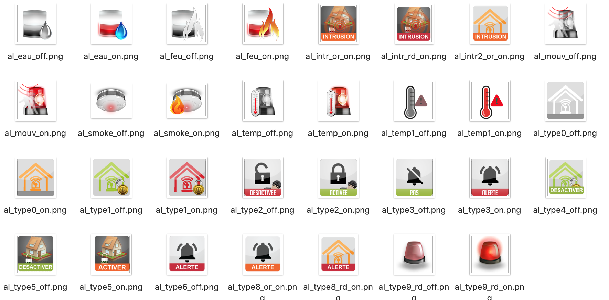

## baro
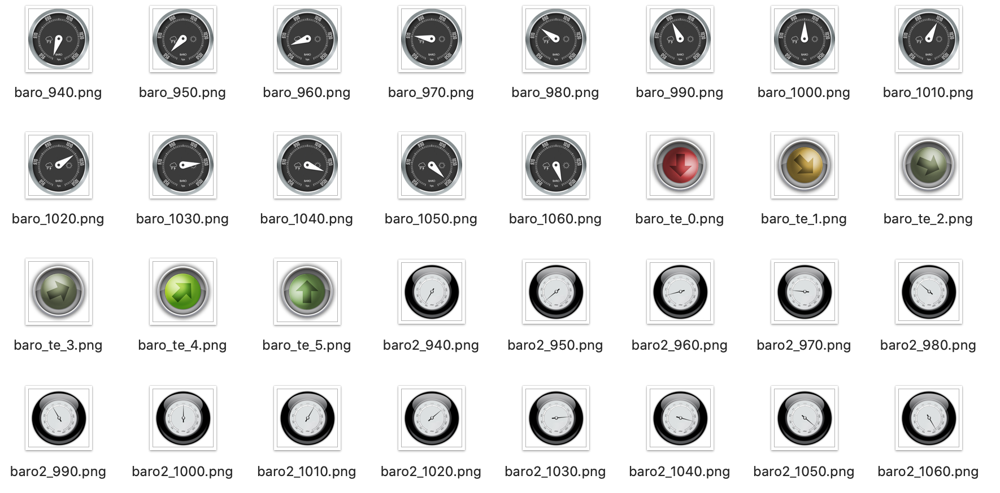

## batterie

## chauffage
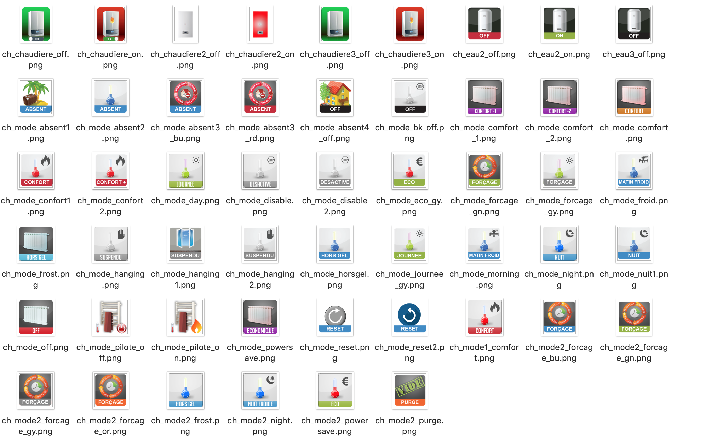

## courriers

## divers
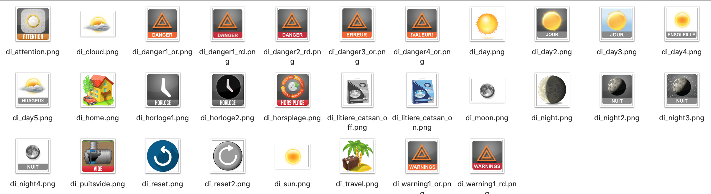

## eau
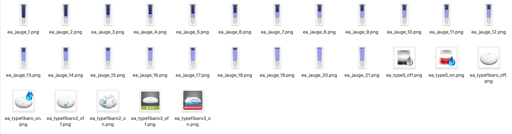

## error

## fenetre

## fibarooeil

## humidite
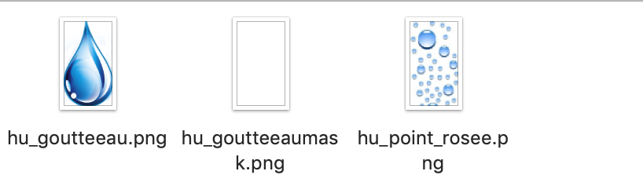

## lampe
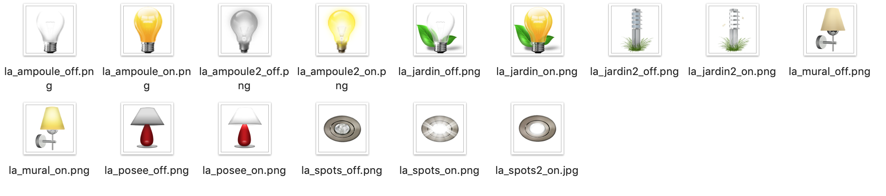

## poubelles
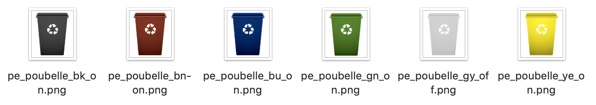

## presence
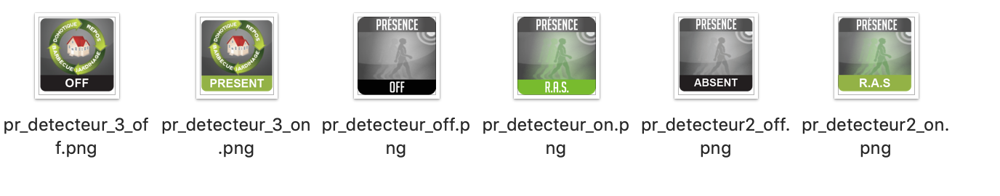

## prise
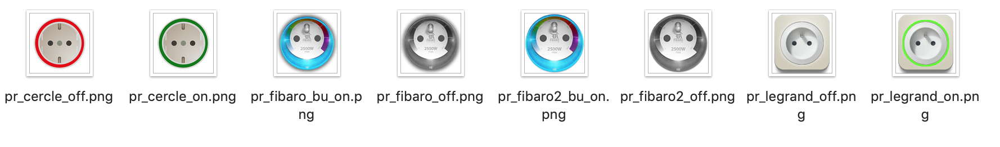

## season

## signal

## store
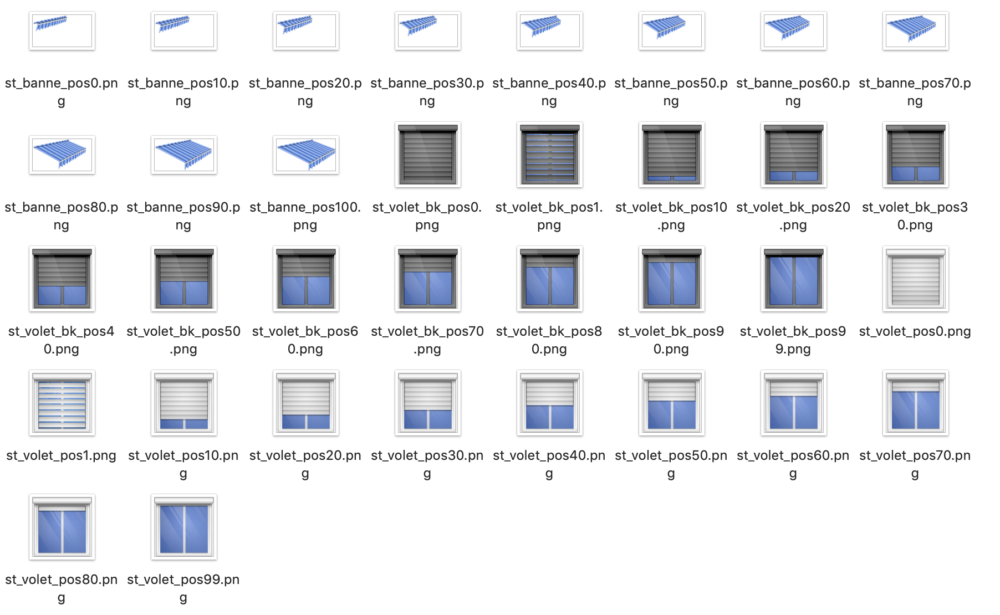

## temperature
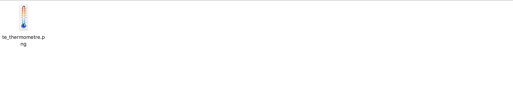

## toggle

## vent
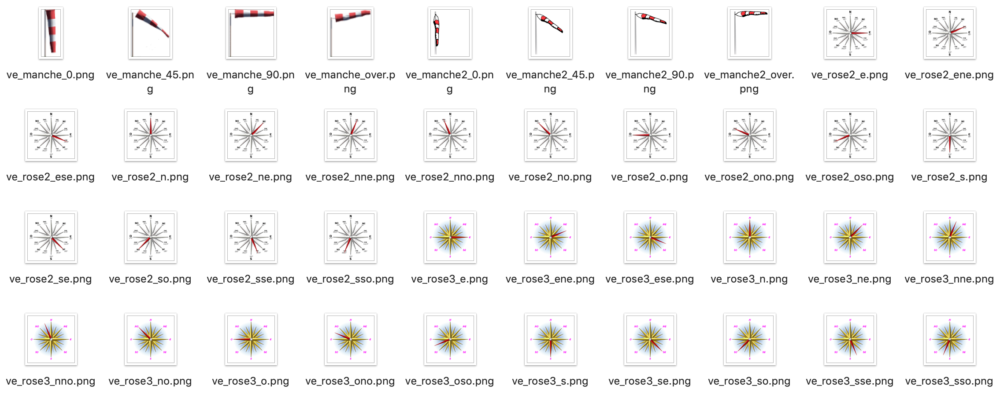

## voyant
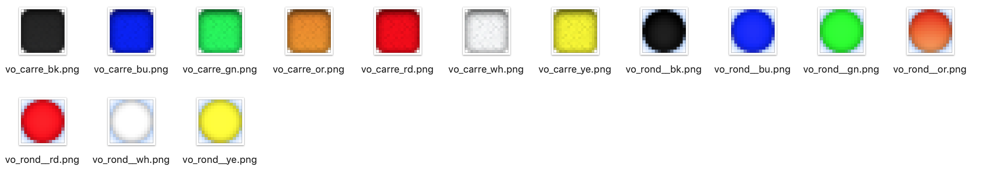

# Télécharger les sources
><a href="HELP_Install_Manu.html">Aide pour l'installation manuelle des widgets</a>
 

<li><a href="https://github.com/JEALG/JEEDOM-Multi_action-Defaut--mobile/tree/masterv4">Télécharger les sources du Widget Multi-action pour le Core V4</a></li>
<li><a href="https://github.com/JEALG/JEEDOM-Multi_action-Defaut--mobile/tree/master">Télécharger les sources du Widget Multi-action pour le Core V3</a></li>

# Changelog
<a href="https://github.com/JEALG/JEEDOM-Widget_JAG-doc/commits/master">Changelog DOC</a>

[back](./)
