[back](./)
# A savoir
<blockquote>
<b>Afin de simplifier la gestion des images, depuis le 10/09/2019, Les images se trouvent uniquement dans le </b><a href="JEEDOM_Multi_action_Defaut">Widget Dashboard : <b>Multi-action</b></a>
</blockquote>

# Liste des images dans les dossiers
Liste des images par dossiers

## alarme
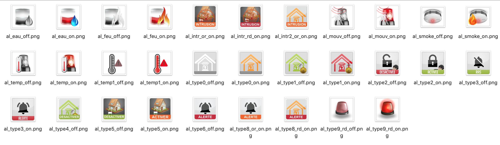

## baro
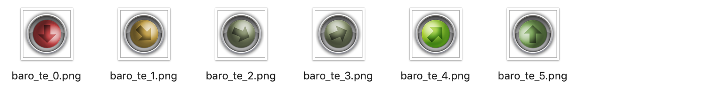

## batterie
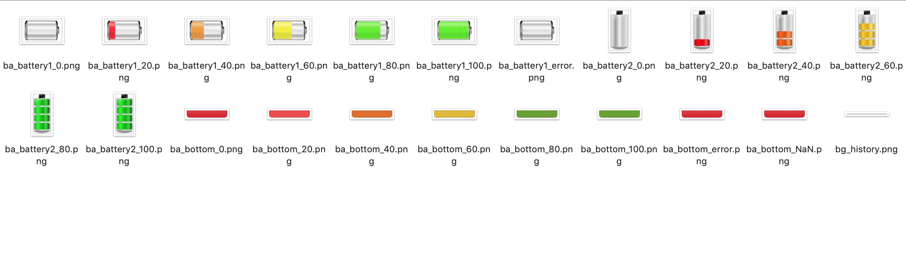

## chauffage

        
## courriers
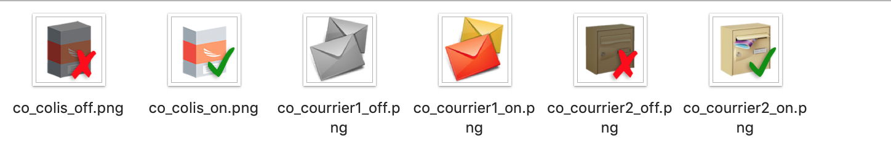
        
## divers

        
## eau
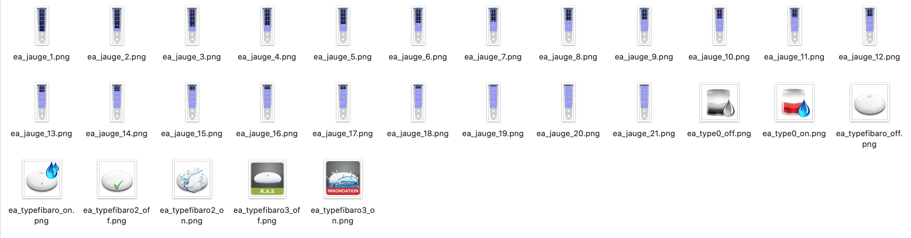
        
## error
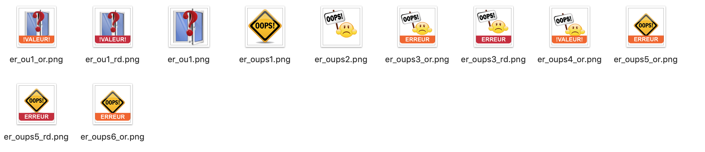
        
## fenetre

        
## fibarooeil
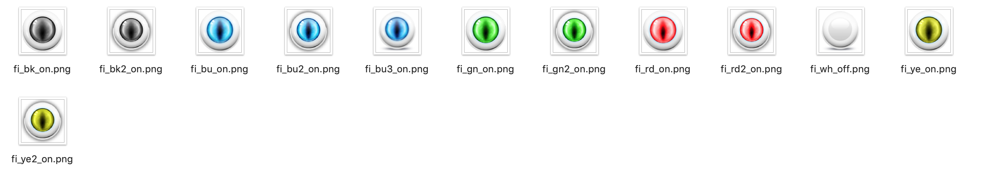
        
## humidite

        
## lampe
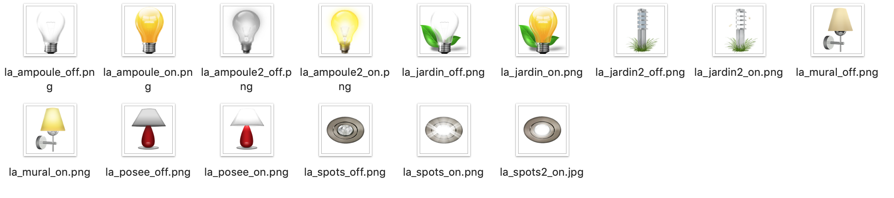
        
## poubelles

        
## presence
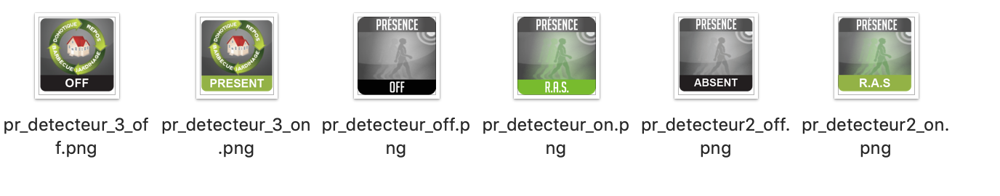
        
## prise
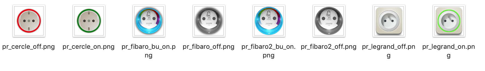
        
## season
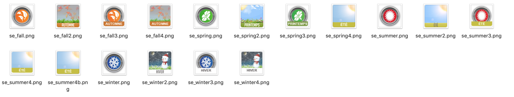
        
## signal
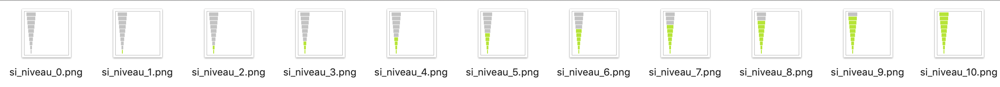
        
## store
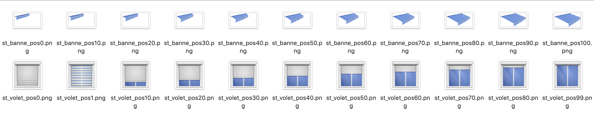

## temperature

## toggle
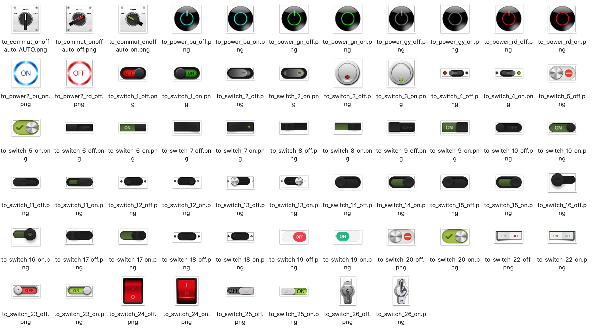

## vent

## voyant

# Télécharger les sources
<li><a href="https://github.com/JEALG/JEEDOM-Multi_action-Defaut--mobile/tree/masterv4">Télécharger les sources du Widget Multi-action pour le Core V4</a></li>
<li><a href="https://github.com/JEALG/JEEDOM-Multi_action-Defaut--mobile/tree/master">Télécharger les sources du Widget Multi-action pour le Core V3</a></li>

# Changelog
<a href="https://github.com/JEALG/JEEDOM-Widget_JAG-doc/commits/master">Changelog DOC</a>

[back](./)
