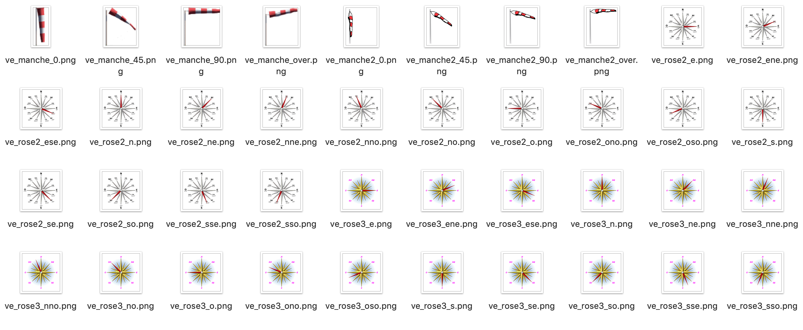

[back](./)
# Widget "Biroute - vent"

Widget pour Jeedom permettant d'afficher une icône pour une fonction de type <b>info binaire</b>

<blockquote>
Le widget inclus plusieurs icônes. Il est possible d'ajouter ses propres icônes.
</blockquote>

# A savoir
<blockquote>
<b>Afin de simplifier la gestion des images, depuis le 10/09/2019, il est nécessaire d'avoir le </b><a href="WIDGET_d_Multi_action_Defaut">Widget Dashboard : <b>Multi-action</b></a>
</blockquote>

# Paramétrage
## Choix de l'icône
Pour choisir le type de visuel à afficher, il faut ajouter les paramètres optionnels suivant :
<blockquote>
    <ul>
        <li><b>logo</b> : Permet de choisir l'image pour la valeur<i>(valeur par défaut : ve_manche2)</i></li>
        <li><b>logo_type</b> : Permet de choisir <i>l'extension</i> pour l'icône/image <i>logoON</i>(par exemple: 'gif', 'jpg', etc.....)<i>(valeur par défaut : png)</i></li>
    </ul>
</blockquote>
<blockquote>
    <ul>
        <li><b>Attention</b> : l'image change en fonction de la vitesse du vent, il ne faut pas mettre _xx dans le paramètre logo</li>
        <li>Si vous utilisez l'image par défaut, il n'est pas necessaire d'ajouter le paramètre <b>logo</b></li>
        <li>Le Widget est basé sur la vitesse du vent em km/h, il faut convertir la vitesse du vent de m/s en km/h directement depuis l'équipement. Il faut ajouter <b>#value#*3.6</b> dans le champs <i>Formule de calcul (#value# pour la valeur)</i> Ne pas oublier ensuite de changer l'unité de la vitesse de vent</li>
    </ul>
</blockquote>

## Taille des images ou des icônes
Il est possible de spécifier la hauteur et la largeur des icônes ou images par l'ajout des paramètres optionnels suivant :
<blockquote>
    <ul>
        <li><b>sizeh</b> : Permet de choisir la hauteur de l'image <i>(valeur par défaut : 80)</i></li>
        <li><b>sizew</b> : Permet de choisir la largeur de l'image <i>(valeur par défaut : 80)</i></li>
    </ul>
</blockquote>

## Ajout d'image
Il est possible d'inclure d'autres icônes dans le widget. 
Le nommage des images est normalisé et doit respecter le format suivant :
<blockquote>
    <ul>
        <li><b>Image</b> : type_xx</li>
        <li><i>Remplacer <b>type</b> par le nom de l'image</i></li>
        <li><i>Remplacer <b>xx</b> par la vitesse de vent (Valeur possible : 0, 45, 90, over)</i></li>
    </ul>
    <ul>
        <li><a href="HELP_ADD_IMG.html">Ajouter des images dans un widget</a></li>
    </ul>
</blockquote>

## Autres paramétrages possible et Aide
<blockquote>
    <ul>
        <li><a href="HELP_CONFIG_INFOS.html">Aide ajout des paramètres pour un widget Info</a></li>
        <li><a href="HELP_Error.html">Paramétrage image de défaut</a></li>
        <li><a href="HELP_STATS.html">Afficher les statistiques</a></li>
        <li><a href="HELP_SIZE.html">Changer la Taille du texte de l'historique</a></li>
        <li><a href="HELP_PARA.html">Ajouter les paramètres sur un widget</a></li>
    </ul>
</blockquote>

# Télécharger les sources
><a href="HELP_Install_Manu.html">Aide pour l'installation manuelle des widgets</a>
 

<li><a href="https://github.com/JEALG/JEEDOM-Biroute_vent/tree/masterv4">Télécharger les sources du Widget pour le Core V4</a></li>
<li><a href="https://github.com/JEALG/JEEDOM-Biroute_vent/tree/master">Télécharger les sources du Widget pour le Core V3</a></li>

# Changelog
<a href="https://github.com/JEALG/JEEDOM-Biroute_vent/commits/masterv4">Changelog WIDGET pour le Core V4</a> 
<a href="https://github.com/JEALG/JEEDOM-Biroute_vent/commits/master">Changelog WIDGET pour le Core V3</a> 
<a href="https://github.com/JEALG/JEEDOM-Widget_JAG-doc/commits/master">Changelog DOC</a>

[back](./)