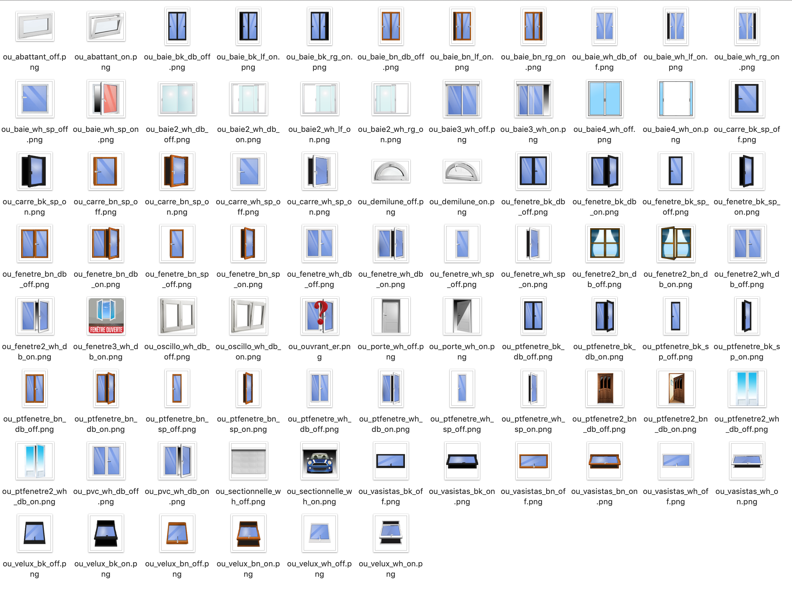

[back](./)
# Widget "Fenêtre (numérique)"

Widget pour Jeedom permettant d'afficher une icône pour une fonction de type <b>info numérique</b>

# A savoir
<blockquote>
<b>Afin de simplifier la gestion des images, depuis le 10/09/2019, il est nécessaire d'avoir le </b><a href="WIDGET_d_Multi_action_Defaut">Widget Dashboard : <b>Multi-action</b></a>
</blockquote>

# Paramétrage
## Choix de l'icône
Pour choisir le type de visuel à afficher, il faut ajouter les paramètres optionnels suivant :
<blockquote>
    <ul>
        <li><b>logo_<b>x</b></b> : Permet de choisir l'image pour la valeur <b>x</b></li>
        <li><b>logo_<b>x</b>_type</b> : Permet de choisir <i>l'extension</i> pour l'icône/image <i>logo_<b>x</b></i> (par exemple: 'gif', 'jpg', etc.....)<i> (valeur par défaut : png)</i></li>
        <li><b>x</b> : Remplacer <b>x</b> par le numéro de la valeur correspondante (valeur possible de 0 à 8)</li>
    </ul>
</blockquote>

Les valeurs pour la variable <b>logo_x</b>par défaut sont :
<blockquote>
    <ul>
        <li><b>logo_<b>0</b></b> : <i>valeur par défaut : ou_baie2_wh_db_off</i></li>
        <li><b>logo_<b>1</b></b> : <i>valeur par défaut : ou_baie2_wh_lf_on</i></li>
        <li><b>logo_<b>2</b></b> : <i>valeur par défaut : ou_baie2_wh_rg_on</i></li>
        <li><b>logo_<b>3</b></b> : <i>valeur par défaut : ou_baie2_wh_db_on</i></li>
        <li><b>logo_<b>4</b></b> : <i>valeur par défaut : ou_baie2_wh_db_on</i></li>
        <li><b>logo_<b>5</b></b> : <i>valeur par défaut : ou_baie2_wh_db_on</i></li>
        <li><b>logo_<b>6</b></b> : <i>valeur par défaut : ou_baie2_wh_db_on</i></li>
        <li><b>logo_<b>7</b></b> : <i>valeur par défaut : ou_baie2_wh_db_on</i></li>
        <li><b>logo_<b>8</b></b> : <i>valeur par défaut : ou_baie2_wh_db_on</i></li>
    </ul>
</blockquote>

## Choix de la valeur
Pour choisir le type de visuel à afficher, il faut ajouter les paramètres optionnels suivant :
<blockquote>
    <ul>
        <li><b>valeur_<b>x</b></b> : Permet de choisir l'image pour la valeur <b>x</b></li>
        <li><b>x</b> : Remplacer <b>x</b> par le numéro de la valeur correspondante (valeur possible de 0 à 5)</li>
    </ul>
</blockquote>

Les valeurs pour la variable <b>valeur_x</b>par défaut sont :
<blockquote>
    <ul>
        <li><b>valeur_<b>0</b></b> : <i>valeur par défaut : 0</i></li>
        <li><b>valeur_<b>1</b></b> : <i>valeur par défaut : 1</i></li>
        <li><b>valeur_<b>2</b></b> : <i>valeur par défaut : 2</i></li>
        <li><b>valeur_<b>3</b></b> : <i>valeur par défaut : 3</i></li>
        <li><b>valeur_<b>4</b></b> : <i>valeur par défaut : 4</i></li>
        <li><b>valeur_<b>5</b></b> : <i>valeur par défaut : 5</i></li>
        <li><b>valeur_<b>6</b></b> : <i>valeur par défaut : 6</i></li>
        <li><b>valeur_<b>7</b></b> : <i>valeur par défaut : 7</i></li>
        <li><b>valeur_<b>8</b></b> : <i>valeur par défaut : 8</i></li>
    </ul>
</blockquote>

## Taille des images ou des icônes
Il est possible de spécifier la hauteur et la largeur des icônes ou images par l'ajout des paramètres optionnels suivant :
<blockquote>
    <ul>
        <li><b>Pourcentage</b> : Permet de choisir la taille en "px" ou "%" <i>(valeur par défaut : NO donc "px")</i></li>
        <ul>
            <li><i>Pourcentage = NO</i> la taille sera en "px"</li>
            <li><i>Pourcentage = YES</i> la taille sera en "%"</li>
        </ul>
            <li><b>sizeh</b> : Permet de choisir la hauteur de l'image <i>(valeur par défaut : 80)</i></li>
            <li><b>sizew</b> : Permet de choisir la largeur de l'image <i>(valeur par défaut : 80)</i></li>
        </ul>
</blockquote>

## Autres paramétrages possible et Aide
<blockquote>
    <ul>
        <li><a href="HELP_config_info.html">Aide ajout des paramètres pour un widget Info</a></li>
        <li><a href="HELP_Error.html">Paramétrage image de défaut</a></li>
        <li><a href="HELP_stats_temps.html">Affichage des informations de durée sur les widgets info (binaire, numérique, actions)</a></li>
        <li><a href="HELP_CONFIG_PARA.html">Ajouter les paramètres sur un widget</a></li>
    </ul>
</blockquote>

### Ajout d'image
<blockquote>
Il est possible d'inclure d'autres icônes dans le widget. 
Le nommage des images n'est pas normalisé sur ce widget
    <ul>
        <li><a href="HELP_ADD_IMG.html">Ajouter des images dans un widget</a></li>
    </ul>
</blockquote>

# Exemples de paramétrage
<li><a href="HELP_para_FENETRES.html">Exemple de paramétrages</a></li>

# Télécharger les sources
><a href="HELP_Install_Manu.html">Aide pour l'installation manuelle des widgets</a>
 

<li><a href="https://github.com/JEALG/JEEDOM-Fenetre/tree/masterv4">Télécharger les sources du Widget pour le Core V4</a></li>
<li><a href="https://github.com/JEALG/JEEDOM-Fenetre/tree/master">Télécharger les sources du Widget pour le Core V3</a></li>

# Changelog
<a href="https://github.com/JEALG/JEEDOM-Fenetre/commits/masterv4">Changelog WIDGET pour le Core V4</a> 
<a href="https://github.com/JEALG/JEEDOM-Fenetre/commits/master">Changelog WIDGET pour le Core V3</a> 
<a href="https://github.com/JEALG/JEEDOM-Widget_JAG-doc/commits/master">Changelog DOC</a>

[back](./)