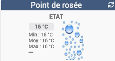
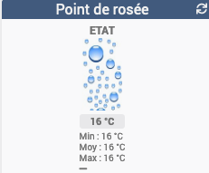

[back](./)

Widget pour Jeedom permettant d'afficher une icône pour une fonction de type <b>info numérique</b>

# A savoir
<blockquote>
<b>Afin de simplifier la gestion des images, depuis le 10/09/2019, il est nécessaire d'avoir le </b><a href="WIDGET_d_Multi_action_Defaut">Widget Dashboard : <b>Multi-action</b></a>
</blockquote>

# Paramétrage
## Taille des images ou des icônes
Il est possible de spécifier la hauteur et la largeur des icônes ou images par l'ajout des paramètres optionnels suivant :
<blockquote>
    <ul>
        <li><b>sizeh</b> : Permet de choisir la hauteur de l'image <i>(valeur par défaut : 80)</i></li>
        <li><b>sizew</b> : Permet de choisir la largeur de l'image <i>(valeur par défaut : 45)</i></li>
    </ul>
</blockquote>

## Position Légende
Il est possible de déplacer la légende

    <TABLE width="100%">
        <TR>
            <th scope="col" width="25%">Nom de la variable</th>
            <th scope="col" width="25%">valeur</th>
            <th scope="col" width="37%">Valeur</th>
        </TR>
        <TR>
            <TD width="25%" rowspan=3>leg_pos</TD>
            <TD width="25%" align="center">right (valeur par défaut)</TD>
            <TD width="50%" align="center"></TD>
        </TR>
        <TR>
            <TD width="25%" align="center">left</TD>
            <TD width="50%" align="center"></TD>
        </TR>
        <TR>
            <TD width="25%" align="center">low</TD>
            <TD width="50%" align="center"></TD>
        </TR>
    </TABLE>

## Autres paramétrages possible et Aide
<blockquote>
    <ul>
        <li><a href="HELP_config_info.html">Aide ajout des paramètres pour un widget Info</a></li>
        <li><a href="HELP_Error.html">Paramétrage image de défaut</a></li>
        <li><a href="HELP_stats.html">Afficher les statistiques</a></li>
        <li><a href="HELP_para.html">Ajouter les paramètres sur un widget</a></li>
    </ul>
</blockquote>

# Télécharger les sources
><a href="HELP_Install_Manu.html">Aide pour l'installation manuelle des widgets</a>
 

<li><a href="https://github.com/JEALG/JEEDOM-Point-rosee/tree/masterv4">Télécharger les sources du Widget pour le Core V4</a></li>
<li><a href="https://github.com/JEALG/JEEDOM-Point-rosee/tree/master">Télécharger les sources du Widget pour le Core V3</a></li>

# Changelog
<a href="https://github.com/JEALG/JEEDOM-Point-rosee/commits/masterv4">Changelog WIDGET pour le Core V4</a> 
<a href="https://github.com/JEALG/JEEDOM-Point-rosee/commits/master">Changelog WIDGET pour le Core V3</a> 
<a href="https://github.com/JEALG/JEEDOM-Widget_JAG-doc/commits/master">Changelog DOC</a>

[back](./)