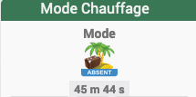

[back](./)
# Widget "Icon_Mode (Mobile)"

Widget pour Jeedom permettant d'afficher une icône pour une valeur <b>info texte</b>

# Info
## Merci
<blockquote>
    <ul>
        <li>Merci @Salviaf pour l'affichage de la durée</li>
        <li>Merci @Nicoraptor pour le code pour récupérer valeur Mode</li>
        <li>Merci @Antoinekl1 pour l'info et le code suite à la modif du plugin "Mode"</li>
    </ul>
</blockquote>

# A savoir
<blockquote>
<b>Afin de simplifier la gestion des images, depuis le 10/09/2019, il est nécessaire d'avoir le </b><a href="WIDGET_d_Multi_action_Defaut">Widget Dashboard : <b>Multi-action</b></a>
</blockquote>

# Paramétrage
## Valeur du mode
Pour que le widget fonctionne, il faut indiquer la valeur du mode dans les variables
<blockquote>
    <ul>
        <li><b>modex</b> : Valeur du mode</li>
        <li><b>x</b> : Remplacer <b>x</b> par le numéro de mode (valeur possible de 0 à 10)</li>
    </ul>
</blockquote>

Pour que le widget fonctionne dans le cas où les noms des commandes sont remplacés par des icônes, il faut indiquer le nom de l'icône dans les variables
<blockquote>
    <ul>
        <li><b>modex</b> : Nom de l'icône</li>
        <li><b>x</b> : Remplacer <b>x</b> par le numéro de mode (valeur possible de 0 à 10)</li>
    </ul>
</blockquote>

## Choix de l'icône
Pour choisir le type de visuel à afficher, il faut ajouter les paramètres optionnels si le nom du mode ne correspond pas au nom de l'image :
<blockquote>
    <ul>
        <li><b>logox</b> : Permet de choisir l'image pour la valeur pour le mode <i>(valeur par défaut : <b>Nom_MODE</b>)</i></li>
        <li><b>logo_typex</b> : Permet de choisir <i>l'extension</i> pour l'icône/image <i>logo</i> (par exemple: 'gif', 'jpg', etc.....)<i>(valeur par défaut : png)</i></li>
        <li><b>x</b> : Remplacer <b>x</b> par le numéro de mode (valeur possible de 0 à 10)</li>
        <li><b>Nom_MODE</b> : correspond au nom exact de l'image</li>
    </ul>
</blockquote>

## Sous dossier
Il possible d'ajouter de mettre les images dans des sous dossiers, (la variable est valable pour l'ensemble des valeurs)
<blockquote>
    <ul>
        <li><b>dossier</b> : Nom du dossier (Par défaut : Chauffage)</li>
        <li><a href="List_img.html">Listes des images par dossiers</a></li>
    </ul>
</blockquote>

## Taille des images ou des icônes
Il est possible de spécifier la hauteur et la largeur des icônes ou images par l'ajout des paramètres optionnels suivant :
<blockquote>
    <ul>
        <li><b>Pourcentage-M</b> : Permet de choisir la taille en "px" ou "%" <i>(valeur par défaut : NO donc "px")</i></li>
        <ul>
            <li><i>Pourcentage-M = NO</i> la taille sera en "px"</li>
            <li><i>Pourcentage-M = YES</i> la taille sera en "%"</li>
        </ul>
        <li><b>sizeh-M</b> : Permet de choisir la hauteur de l'image <i>(valeur par défaut : 40)</i></li>
        <li><b>sizew-M</b> : Permet de choisir la largeur de l'image <i>(valeur par défaut : 40)</i></li>
    </ul>
</blockquote>

## Autres paramétrages possible
<blockquote>
    <ul>
        <li><a href="HELP_config_info.html">Aide ajout des paramètres pour un widget Info</a></li>
        <li><a href="HELP_Error.html">Paramétrage image de défaut</a></li>
        <li><a href="HELP_STATS.html">Afficher les statistiques</a></li>
        <li><a href="HELP_STATS_TEMPS.html">Affichage des informations de durée sur les widgets info (binaire, numérique)</a></li>
        <li><a href="HELP_para.html">Ajouter les paramètres sur un widget</a></li>
    </ul>
</blockquote>

# Exemple Paramétrage d'un mode

## Exemple 1
Un Premier exemple avec le mode0 = CONFORT et le nom de l'image est "CONFORT.PNG"
<blockquote>
    <ul>
        <li><b>mode0</b> : renseigner la valeur <b>CONFORT</b></li>
        <li><b>logo0</b> : Il n'est pas nécessaire de le renseigner vu que le nom du mode est identique au nom de l'image</li>
        <li><b>logo_type0</b> : Il n'est pas nécessaire de le renseigner vu que l'extension de l'image est <i>png</i></li>
    </ul>
</blockquote>
## Exemple 2
Un deuxième exemple avec le mode5 = PURGE et le nom de l'image est "puitsvide.PNG"
<blockquote>
    <ul>
        <li><b>mode5</b> : renseigner la valeur <b>PURGE</b></li>
        <li><b>logo5</b> : renseigner la valeur <b>puitsvide</b></li>
        <li><b>logo_type5</b> : Il n'est pas nécessaire de le renseigner vu que l'extension de l'image est <i>png</i></li>
    </ul>
</blockquote>

# Télécharger les sources
><a href="HELP_Install_Manu.html">Aide pour l'installation manuelle des widgets</a>
 

<li><a href="https://github.com/JEALG/JEEDOM-Icon_Mode--Mobile/tree/masterv4">Télécharger les sources du Widget pour le Core V4</a></li>
<li><a href="https://github.com/JEALG/JEEDOM-Icon_Mode--Mobile/tree/master">Télécharger les sources du Widget pour le Core V3</a></li>

# Changelog
<a href="https://github.com/JEALG/JEEDOM-Icon_Mode--Mobile/commits/masterv4">Changelog WIDGET pour le Core V4</a> 
<a href="https://github.com/JEALG/JEEDOM-Icon_Mode--Mobile/commits/master">Changelog WIDGET pour le Core V3</a> 
<a href="https://github.com/JEALG/JEEDOM-Widget_JAG-doc/commits/master">Changelog DOC</a>

[back](./)