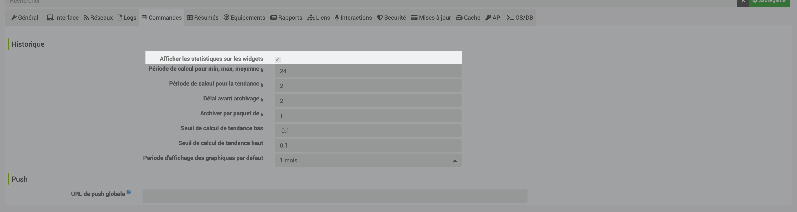

[back](../)
# Affichage de l'historique 

<h4 id="Error">Activation de l'historique</h4>
Il est impératif que l'info de l'équipement soit historisé pour être afficher

<h4 id="Error">Afficher les statistiques sur les widgets</h4>
Il faut vérifier que la case "Afficher les statistiques sur les widgets" soit coché dans la configuration de jeedoom

<h4 id="Error">Afficher les statistiques sur le widget</h4>
Dans les réglages de chaque commande, cliquer sur la roue

Ensuite cocher <i>Afficher les statistiques</i> soit pour le Dashboard soit pour le mobile soit pour les 2 dans l'onglet <b>Affichage</b>

<dl>
    <a href="https://github.com/JEALG/JEEDOM-Widget_JAG-doc/commits/master">Changelog DOC</a>
</dl>

[back](../)