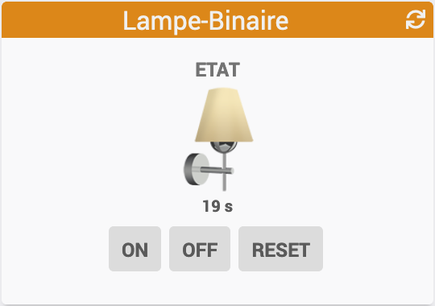

[back](../JEEDOM_Archive_info_binaire.html)
# Widget "Lampe-Binaire" 

<h4 id="A Savoir">A savoir</h4>
<blockquote>
    <b>Afin de simplifier la gestion des images et la migration du widget en Core V4, depuis le 10/09/2019, ce widget est remplacé par le widget <a href="../../JEEDOM_Multi_info_Binaire_mobile.html">Widget Mobile : <b>Multi info - Binaire (mobile)</b></a></b>
    <ul>
        <li><b>Pour avoir les images </b><a href="../../JEEDOM_Multi_action_Defaut">Widget Dashboard : <b>Multi-action</b></a></li>
        <li><b>Pour avoir le paramétrage par défaut du widget Lampe-Binaire, il faudra ajouter pour avoir le logo par défaut de ce widget </b> :</li>
        <ul>
            <li><b>dossier</b> avec la valeur : <i>lampe</i></li>
            <li><b>logo</b> avec la valeur : <i>la_ampoule</i></li>
            <li><b>Les autres variables sont identiques</b></li>
        </ul>
    </ul>
</blockquote>

Widget pour Jeedom permettant d'afficher une icône pour une fonction de type <b>info binaire</b>

<blockquote>
Le widget inclus plusieurs icônes. Il est possible d'ajouter ses propres icônes.
</blockquote>

<h1 id="Type de paramètre">Type de paramètre</h1>

<h4 id="Logo">Choix de l'icône</h4>
Pour choisir le type de visuel à afficher, il faut ajouter les paramètres optionnels suivant :
<blockquote>
        <ul>
            <li><b>logo</b> : Permet de choisir l'image pour la valeur ON ou OFF <i>(valeur par défaut : la_ampoule)</i></li>
            <li><b>logo_type</b> : Permet de choisir <i>l'extension</i> pour l'icône/image <i>logo</i> (par exemple: 'gif', 'jpg', etc.....)<i>(valeur par défaut : png)</i></li>
        </ul>
</blockquote>

<h4 id="Taille">Taille des images ou des icônes</h4>
Il est possible de spécifier la hauteur et la largeur des icônes ou images par l'ajout des paramètres optionnels suivant :
<blockquote>
        <ul>
            <li><b>sizeh</b> : Permet de choisir la hauteur de l'image <i>(valeur par défaut : 80)</i></li>
            <li><b>sizew</b> : Permet de choisir la largeur de l'image <i>(valeur par défaut : 80)</i></li>
        </ul>
</blockquote>

<dl>
    <a href="https://github.com/JEALG/JEEDOM-Lampe-Binaire/commits/master">Changelog WIDGET</a> 
    <a href="https://github.com/JEALG/JEEDOM-Widget_JAG-doc/commits/master">Changelog DOC</a>
</dl>

[back](../JEEDOM_Archive_info_binaire.html)