**Ensemble de la documentation pour les widgets JAG**

# infos
## A Savoir
>**Afin de simplifier la gestion des images, depuis le 10/09/2019, il est nécessaire d'avoir le widget "Multi_action-Defaut" pour tous les widgets** 
>Dans chaque widget, un exemple de configuration est disponible

## Nettoyage des Dossiers
Cette partie de doc va expliquer comment nettoyer les dossiers
><a href="HELP_clean_folder.html">Nettoyage des dossiers</a>

## Installation Manuelle des widgets
Cette partie de doc va donner la procédure pour installer manuellement les widgets pour le Core V3/v4
><a href="HELP_Install_Manu.html">Installation Manuelle des widgets pour le Core V3/V4</a>

# Les widgets

## Dashboard

Nom du Widget | Exemple | Docs/Téléchargement
--- | --- | ---
**Voyant Multi-couleur** | 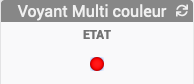|<a href="./WIDGET_d_VoyantMulticouleur.html">Lien</a> |
**Store Banne** |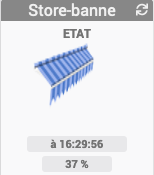 | <a href="./WIDGET_d_Store_banne.html">Lien</a>
**Icone_Mode** |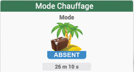 | <a href="./WIDGET_d_Icon_Mode.html">Lien</a>
**Multi-action** | | <a href="./WIDGET_d_Multi_action_Defaut.html">Lien</a>
**Multi info - Binaire** |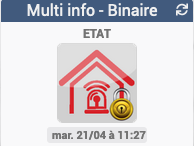 | <a href="./WIDGET_d_Multi_info_Binaire.html">Lien</a>
**Batterie - EeDomus** |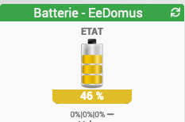 | <a href="./WIDGET_d_Bat_EeDomus.html">Lien</a>
**Batterie - telldusBatter** |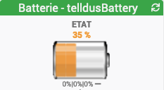 | <a href="./WIDGET_d_Bat_telldusBattery.html">Lien</a>
**Humidite-Goutte_eau** |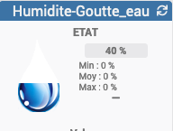 | <a href="./WIDGET_d_Humidite_Goutte_eau.html">Lien</a>
**Luminosité-IMG-Mini** |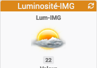 | <a href="./WIDGET_d_Lum_IMG_mini.html">Lien</a>
**Baromètre** |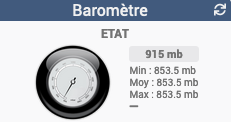 | <a href="./WIDGET_d_baro.html">Lien</a>
**Biroute - vent** |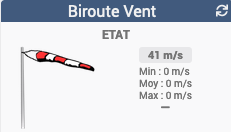 | <a href="./WIDGET_d_biroute.html">Lien</a>
**Point de rosée** |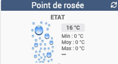 | <a href="./WIDGET_d_rosee.html">Lien</a>
**Tendance-Baro** |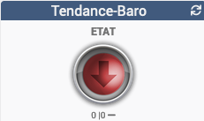 | <a href="./WIDGET_d_tendance.html">Lien</a>
**Fenêtre (numérique)** |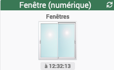 | <a href="./WIDGET_d_fenetre.html">Lien</a>
**Store-VELUX (numérique)** |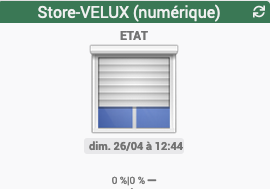 | <a href="./WIDGET_d_Store_Velux_num.html">Lien</a>
**Température Thermomètre** |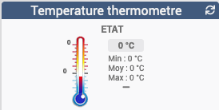 | <a href="./WIDGET_d_Thermometre.html">Lien</a>

## Mobile

Nom du Widget | Exemple | Docs/Téléchargement
--- | --- | ---
**Voyant Multi-couleur** | 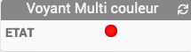|<a href="./WIDGET_m_VoyantMulticouleur.html">Lien</a> |
**Icone_Mode** | | <a href="./WIDGET_m_Icon_Mode.html">Lien</a>
**Multi-action** |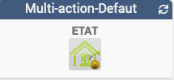 | <a href="./WIDGET_m_Multi_action_Defaut.html">Lien</a>
**Multi info - Binaire** |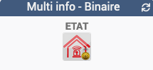 | <a href="./WIDGET_m_Multi_info_Binaire.html">Lien</a>
**Humidite-Goutte_eau** |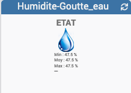 | <a href="./WIDGET_m_Humidite_Goutte_eau.html">Lien</a>
**Luminosité-IMG-Mini** |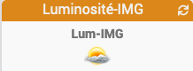 | <a href="./WIDGET_m_Lum_IMG_mini.html">Lien</a>
**Fenêtre (numérique)** |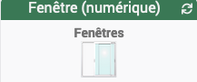 | <a href="./WIDGET_m_fenetre.html">Lien</a>
**Température Thermomètre** |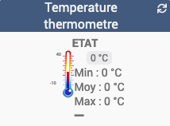 | <a href="./WIDGET_m_Thermometre.html">Lien</a>

# Aide aux paramétrages
Cette rubrique regroupe de l'aide aux paramétrages des différents widgets

>* <a href="HELP_Error.html">Paramétrage image Erreur</a>
>* <a href="HELP_STATS.html">Afficher les statistiques</a>
>* <a href="HELP_STATS_TEMPS.html">Affichage des informations de durée sur les widgets de type info (binaire, numérique)</a>
>* <a href="HELP_SIZE.html">Aide pour changer la taille du texte pour des widgets de type info (uniquement pour le Core V3)</a>
>* <a href="HELP_PARA.html">Ajouter les paramètres sur un widget</a>
>* <a href="HELP_ADD_IMG.html">Ajouter des images dans un widget (uniquement pour le Core V3)</a>

 
## Exemple de paramétrage avec un virtuel
>* <a href="HELP_config_info.html">Aide pour le paramétrage des widgets de type info (binaire, numérique, actions)</a>
>* <a href="HELP_config_action.html">Aide pour le paramétrage des widgets de type action</a>

## Exemple de paramétrage avec le plugin Alarme
>* <a href="HELP_config_plugin_alarm.html">Exemple d'utilisation des widgets Multi-action et Multi-info avec le plugin Alarme</a>

# Liste des images
Cette rubrique regroupe les différentes images disponibles pour les widgets
>* <a href="./List_img.html">Listes des images des widgets </a>

# Changelog
<a href="https://github.com/JEALG/JEEDOM-Widget_JAG-doc/commits/master">Changelog DOC</a>