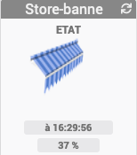

**Ensemble de la documentation pour les widgets JAG**

# infos
## A Savoir
>**Afin de simplifier la gestion des images, depuis le 10/09/2019, il est nécessaire d'avoir le widget "Multi_action-Defaut" pour tous les widgets**
>
>Dans chaque widget, un exemple de configuration est disponible

## Nettoyage des Dossiers
> Cette partie de doc va expliquer comment nettoyer les dossiers
* <a href="JEEDOM_AIDE_Clean_Folder.html">Nettoyage des dossiers</a>

## Installation Manuelle des widgets
> Cette partie de doc va donner la procédure pour installer manuellement les widgets pour le Core V3/v4
* <a href="JEEDOM_AIDE_Install_Manu.html">Installation Manuelle des widgets pour le Core V3/V4</a>

# Les widgets

Nom du Widget | Dashboard | Mobile | Docs/Téléchargement
--- | --- | --- | ---
 **Voyant Multi-couleur** |  |    |<a href="./JEEDOM_VoyantMulticouleur.html">Docs et Téléchargement</a> |
**Store Banne** || *Pas de version* | <a href="./JEEDOM_Store_banne.html">Docs et Téléchargement</a>

## Automatisme

* <a href="./JEEDOM_VoyantMulticouleur.html">Widget Dashboard : <b>Bouton en forme de voyant Multi couleur</b></a>
* <a href="./JEEDOM_VoyantMulticouleur_MOBILE.html">Widget Mobile : <b>Bouton en forme de voyant Multi couleur</b></a>
* <a href="./JEEDOM_Store_banne.html">Widget Dashboard : <b>Store-banne</b></a>

## Autre
* <a href="./JEEDOM_Icon_Mode.html">Widget Dashboard : <b>Icon_Mode</b></a>
* <a href="./JEEDOM_Icon_Mode_Mobile.html">Widget Mobile : <b>Icon_Mode (mobile)</b></a>
* <a href="./JEEDOM_Multi_action_Defaut">Widget Dashboard : <b>Multi-action</b></a>
    * <a href="JEEDOM_Archive_Multiaction.html">Voir les anciens widgets prises en charge par ce widget</a>
* <a href="./JEEDOM_Multi_action_Defaut_mobile.html">Widget Mobile : <b>Multi-action (mobile)</b></a>
    * <a href="JEEDOM_Archive_Multiaction_mobile.html">Voir les anciens widgets prises en charge par ce widget</a>
* <a href="./JEEDOM_Multi_info_Binaire.html">Widget Dashboard : <b>Multi info - Binaire</b></a>
    * <a href="JEEDOM_Archive_Multiinfo.html">Voir les anciens widgets prises en charge par ce widget</a>
* <a href="./JEEDOM_Multi_info_Binaire_mobile.html">Widget Mobile : <b>Multi info - Binaire (mobile)</b></a>
    * <a href="JEEDOM_Archive_Multiinfo_mobile.html">Voir les anciens widgets prises en charge par ce widget</a>

## Énergie
* <a href="./JEEDOM_Batterie_EeDomus.html">Widget Dashboard : <b>Batterie - EeDomus</b></a>
* <a href="./JEEDOM_Batterie_telldusBattery.html">Widget Dashboard : <b>Batterie-telldusBattery</b></a>

## Humidité
* <a href="./JEEDOM_Humidite_Goutte_eau.html">Widget Dashboard : <b>Humidite-Goutte_eau</b></a>
* <a href="./JEEDOM_Humidite_Goutte_eau_Mobile.html">Widget mobile : <b>Humidite-Goutte_eau (mobile)</b></a>

## Lumière
* <a href="./JEEDOM_Lum_IMG_mini.html">Widget Dashboard : <b>Luminosité-IMG-Mini</b></a>
    * <a href="JEEDOM_Archive_Luminosite.html">voir l'ancien Widget Dashboard : <b>Luminosité-IMG</b></a>
* <a href="./JEEDOM_Lum_IMG_mini_MOBILE.html">Widget Mobile : <b>Luminosité-IMG-Mini (mobile)</b></a>

## Météo
* <a href="./JEEDOM_Barometre.html">Widget Dashboard : <b>Baromètre</b></a>
* <a href="./JEEDOM_Biroute_vent.html">Widget Dashboard : <b>Biroute - vent</b></a>
* <a href="./JEEDOM_Point_rosee.html">Widget Dashboard : <b>Point de rosée</b></a>
* <a href="./JEEDOM_Tendance_Baro.html">Widget Dashboard : <b>Tendance-Baro</b></a>

## Ouverture
* <a href="./JEEDOM_Fenetre.html">Widget Dashboard : <b>Fenêtre (numérique)</b></a>
* <a href="./JEEDOM_Fenetre_MOBILE.html">Widget Mobile: <b>Fenêtre (mobile) (numérique)</b></a>
* <a href="./JEEDOM_Store_Velux_num.html">Widget Dashboard : <b>Store-VELUX (numérique)</b></a>

## Température
* <a href="./JEEDOM_Thermometre.html">Widget Dashboard : <b>Temperature thermometre</b></a>
* <a href="./JEEDOM_Thermometre_MOBILE.html">Widget Mobile : <b>Temperature thermometre (mobile)</b></a>

# Aide aux paramétrages
>Cette rubrique regroupe de l'aide aux paramétrages des différents widgets

* <a href="JEEDOM_AIDE_Error.html">Paramétrage image Erreur</a>
* <a href="JEEDOM_AIDE_STATS.html">Afficher les statistiques</a>
* <a href="JEEDOM_AIDE_STATS_TEMPS.html">Affichage des informations de durée sur les widgets de type info (binaire, numérique)</a>
* <a href="JEEDOM_AIDE_CONFIG_INFOS.html">Aide pour le paramétrage des widgets de type info (binaire, numérique)</a>
* <a href="JEEDOM_AIDE_CONFIG_ACTION.html">Aide pour le paramétrage des widgets de type action</a>
* <a href="JEEDOM_AIDE_SIZE.html">Aide pour changer la taille du texte pour des widgets de type info</a>
* <a href="JEEDOM_AIDE_PARA.html">Ajouter les paramètres sur un widget</a>
* <a href="JEEDOM_AIDE_ADD_IMG.html">Ajouter des images dans un widget</a>

# Liste des images
>Cette rubrique regroupe les différentes images disponible pour les widgets
* <a href="./JEEDOM_Liste_images_dossiers.html">Listes des images des widgets </a>

# Changelog
<a href="https://github.com/JEALG/JEEDOM-Widget_JAG-doc/commits/master">Changelog DOC</a>