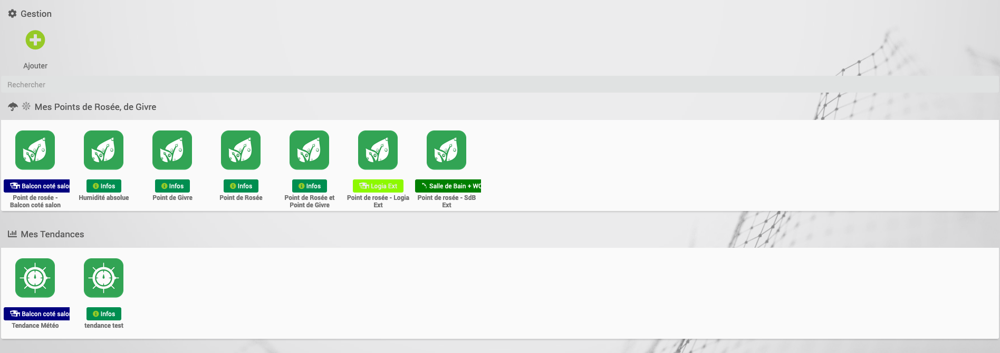
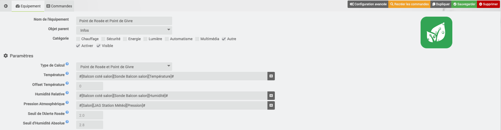
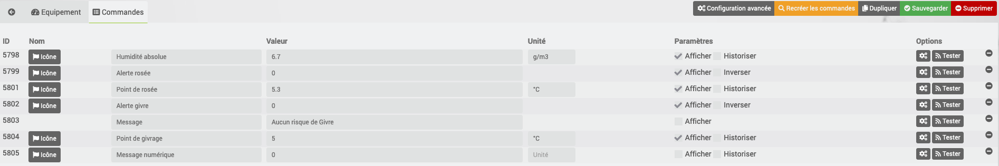
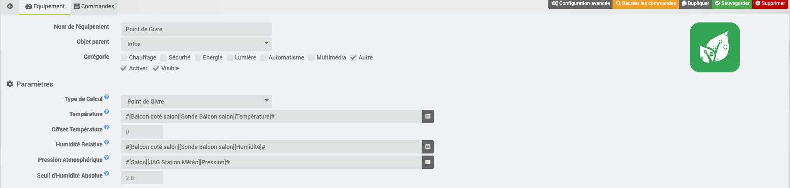
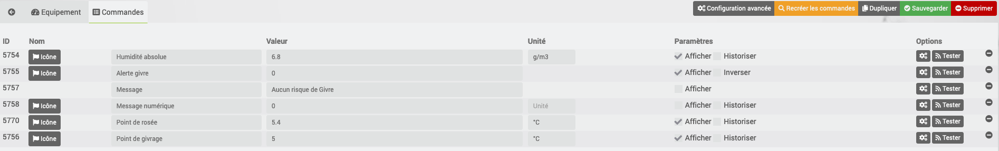
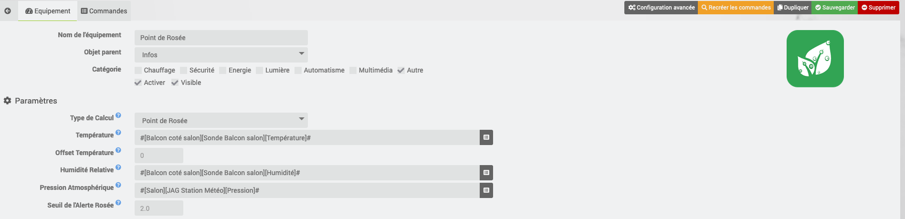
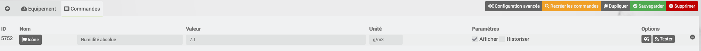
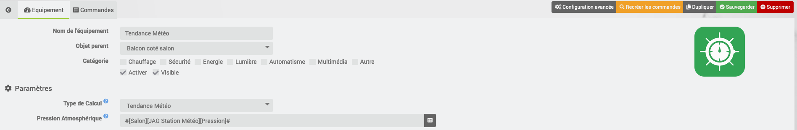
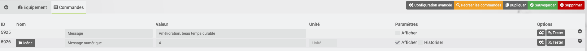

# Description

Ce plugin permet d'obtenir le point de rosée pour savoir si l'herbe sera mouillée le matin, ou bien en hiver savoir s'il va falloir gratter le pare-brise.
Pour fonctionner, on doit indiquer un équipement température et un équipement humidité (extérieures, bien-sûr…).
Il est aussi possible de calculer la tendance Météo à venir en se basant de l'évolution de la météo.

# Configuration

Le plugin ne comporte pas de configuration générale, il faut :

>- Choisir une méthode de calcul :
    - Humidité absolue
    - Point de Givre
    - Point de Rosée
    - Point de Rosée et Point de Givre
    - Tendance Météo

>- Renseigner les champs obligatoire suivant la méthode de calcul :
    - Équipement "Température" (°C)
    - Équipement "Humidité Relative" (%)
    - Équipement "Pression Atmosphérique" (hPa) : Ce champs est obligatoire pour la méthode de calcul "Tendance Météo" et il doit être avoir l'historique d'activé. Pour les autres calculs, la valeur est fixée à 1013.25 hPa si non renseignée

<b>En option</b>
> - Seuil de l'Alerte Rosée (°C) : Seuil de déclenchement de l'alerte rosée, 2°C par défaut (dépression du point de rosée T°-Tr°) A ajuster en fonction des observations locales.
> - Seuil d'humidité absolue : Seuil humidité absolue en dessous duquel il est peu probable qu'il givre, 2.8 par défaut.
> - Offset Température : A ajuster en fonction des observations locales et de la position de la sonde, 0 par défaut.

# Alerte Givre
> Sources :
> - <a href="https://pon.fr/dzvents-alerte-givre-et-calcul-humidite-absolue/">https://pon.fr/dzvents-alerte-givre-et-calcul-humidite-absolue/</a>

Le plugin calcule 4 niveaux d'alerte :
- Cas N°0 :
    >- Calcul : Aucun cas ci-dessous couvert
    >- Alerte Givre : 0
    >- Alerte Rosée : Automatique
    >- Message numérique Givre : 0
    >- Message d'info : Aucun risque de Givrage
- Cas N°1 :
    >- Calcul : (Température <=1 et Point de Givrage <= 0) et (Humidité absolue en (gr/m3) < Seuil d'humidité absolue)
    >- Alerte Givre : 1
    >- Alerte Rosée : forcé à 0
    >- Message numérique Givre : 1
    >- Message d'info : Givre peu probable malgré la température
- Cas N°2 :
    >- Calcul : (Température <=4 et Point de Givrage <= 0.5)
    >- Alerte Givre : 1
    >- Alerte Rosée : forcé à 0
    >- Message numérique Givre : 2
    >- Message d'info : Risque de givre
- Cas N°3 :
    >- Calcul : (Température <=1 et Point de Givrage <= 0) et (Humidité absolue en (gr/m3) > Seuil d'humidité absolue)
    >- Alerte Givre : 1
    >- Alerte Rosée : forcé à 0
    >- Message numérique Givre : 3
    >- Message d'info : Givre, Présence de givre

# Tendance Météo
> Sources :
> - <a href="http://www.freescale.com/files/sensors/doc/app_note/AN3914.pdf">http://www.freescale.com/files/sensors/doc/app_note/AN3914.pdf</a>
> - <a href="https://www.parallax.com/sites/default/files/downloads/29124-Altimeter-Application-Note-501.pdf">https://www.parallax.com/sites/default/files/downloads/29124-Altimeter-Application-Note-501.pdf</a>

Le plugin calcule 6 niveaux d'information :
- Niveau 0 :
    >- Tendance : Forte dégradation, instable
    >- Tendance numérique : 0
- Niveau 1 :
    >- Tendance : Dégradation, mauvais temps durable
    >- Tendance numérique : 1
- Niveau 2 :
    >- Tendance : Lente dégradation, temps stable
    >- Tendance numérique : 2
- Niveau 3 :
    >- Tendance : Lente amélioration, temps stable
    >- Tendance numérique : 3
- Niveau 4 :
    >- Tendance : Amélioration, beau temps durable
    >- Tendance numérique : 4
- Niveau 5 :
    >- Tendance : Forte embellie, instable
    >- Tendance numérique : 5

Le plugin affecte par défaut un widget (uniquement pour le Core V4) : 

# FAQ

-   Est-ce que le plugin s'appuie sur des API tiers ?

>Non, le plugin fait le calcul en interne par rapport à la température et l’humidité extérieure.

-   C’est quoi le point de rosée ?

>Le point de rosée ou température de rosée est la température la plus basse à laquelle une masse d'air peut être soumise, à pression et humidité données, sans qu'il se produise une formation d'eau liquide par saturation.
>
>La notion de point de rosée est une notion de base importante dans le fonctionnement des sécheurs frigorifiques d'air comprimé et de la condensation atmosphérique créant les hydrométéores. Il est une donnée déterminante dans l'isolation thermique du bâtiment qui permettra de savoir s'il y a un risque que l'humidité ambiante d'une pièce se condense en traversant les couches successives d'un mur extérieur, dans lequel chaque couche affiche un gradient de température particulier, dégressif vers l'extérieur. Le cas échéant, l'humidité qui se condense peut provoquer la détérioration de la couche dans laquelle le phénomène se produit.
(Source Wikipédia)

-   Et le point de givrage ?

>Le point de givrage, connu également comme la température du point givrage ou le point de gelée, est une donnée météorologique calculée à partir de l'humidité, la pression et la température. Le point de givrage de l'air est la température à laquelle, tout en gardant inchangées les conditions barométriques courantes, l'air devient saturé de vapeur d'eau par rapport à la glace. Le point de givrage est donc l'équivalent du point de rosée pour la condensation de la vapeur d'eau directement en cristaux de glace et non en microgouttelettes. C'est le phénomène de déposition, qui survient lorsque le point de givre est atteint, qui créé la gelée blanche.
>
>Le point de givrage n'est donc défini que sous le point de congélation. Il coexiste avec le point de rosée à ces températures mais comme la pression de vapeur saturante par rapport à la glace est plus faible, le point de givrage est atteint plus rapidement. La capacité hygrométrique détermine les phénomènes de saturation, plus il fait froid, moins l'air peut contenir d'humidité (humidité absolue) et les deux se rejoignent à zéro degré Celsius.
(Source Wikipédia)

# Exemple de configuration
## Vue de la liste des équipements

## Exemple de configuration avec la méthode de calcul "Point de Rosée et Point de Givre"

## Exemple de configuration avec la méthode de calcul "Point de Givre"

## Exemple de configuration avec la méthode de calcul "Point de rosée"

## Exemple de configuration avec la méthode de calcul "Humidité absolue"

## Exemple de configuration avec la méthode de calcul "Tendance Météo"

# Troubleshotting

- Je n'ai pas d'informations qui remontent

>Il faut bien indiquer les équipements nécessaires pour les différents calculs. 
>On peut rechercher les équipements grâce au bouton de recherche de l’équipement.

- Le point de givrage est égal 5°C

>La température dépasse 5°C donc le point de givrage n'est plus calculé et sa valeur est fixé à 5.

- Le calcul de la tendance ne se fait pas

>Il faut attendre 4h pour avoir des résultats corrects lors de la création de l'équipement.
>L'équipement doit être avoir l'historique d'activé pour fonctionner.

# Changelog
[changelog](https://jealg.github.io/plugin-rosee/fr_FR/changelog)